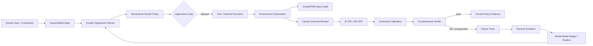

<div align="center">

# GrowthEvo-Harness

### Causal Reinforcement Learning Runtime for Autonomous User Growth

**让 Growth Agent 在因果增量、预算约束与可回滚边界内自主做增长决策，并从失败与分布漂移中安全演进。**

`CAUSAL POMDP` · `HIERARCHICAL RL` · `β*-IPS / DR OPE` · `CONFORMAL GATE` · `GROWTHPRM` · `RISK-SENSITIVE MPC` · `WORLD MODEL` · `HARNESS EVOLUTION`

</div>

---

## Product Thesis

传统营销自动化回答的是“执行什么活动”；GrowthEvo 关注的是更难的问题：

> **对谁、什么时候、通过什么渠道、给什么权益或内容、投入多少预算，以及什么时候应该什么都不做。**

GrowthEvo-Harness 将用户增长建模为带预算、ROI、触达频控、用户疲劳和延迟反馈约束的 **Causal POMDP**。LLM/Planner 负责增长假设、分群、工具与子任务规划；RL Policy 负责渠道、权益、时机和预算等数值决策；Counterfactual Verifier 只在增量价值、日志策略覆盖和风险证据都足够时允许策略晋级。

核心目标不是 raw conversion，而是 **incremental outcome**：

\[
\tau(x,a)=\mathbb E[Y(a)-Y(a_0)\mid X=x]
\]

其中 `a0 = NO_TREATMENT`。如果一个用户本来就会购买，系统应学会不发券、不打扰、节省预算。

---

## Runtime Loop



### Two-timescale learning

GrowthEvo 把学习分成两个时间尺度：

1. **Fast loop — Growth Policy Learning**：针对当前用户与增长目标学习 `target / channel / offer / timing / budget / no-treatment`。
2. **Slow loop — Harness Evolution**：从错误归因、预算浪费、疲劳、工具失败和分布漂移中修改 Planner、Memory、Reward Shaping、Feature Routing 与 Exploration 参数；安全内核和 North-Star Metric 保持冻结。

---

## v0.2 · Frontier RL Upgrade

v0.2 把第一版的“因果 reward + DR OPE + LCB”升级成四个可以独立测试、独立替换的学习组件。

### 1. β*-IPS + overlap diagnostics

除了 IPS 与 Doubly-Robust，Runtime 现在实现 **estimated β\*-IPS additive control variate**：

\[
\hat V_{\beta}=
\frac1n\sum_i\left[w_i r_i-\hat\beta(w_i-1)\right],
\qquad
\hat\beta=\frac{\widehat{Cov}(w r,w-1)}{\widehat{Var}(w-1)}
\]

同时将以下信息纳入正式 Policy Evidence：

- IPS / DR / β\*-IPS
- estimator standard error
- Effective Sample Size / ESS ratio
- practical support coverage
- max importance weight
- importance-weight coefficient of variation

**收益高但 logging policy 没覆盖的候选策略不会被晋级。**

### 2. Split-Conformal Promotion Gate

历史 shadow/canary cohort 成熟后，用预测值与真实值之间的 residual 校准 one-sided margin：

\[
LCB_{conf}(\Delta V)=\widehat{\Delta V}-q_{1-\alpha}(\hat\Delta V-\Delta V)
\]

ROI 使用 lower bound，Spend / Fatigue / Churn 使用 upper bound。Verifier 取统计 LCB 与 conformal LCB 中更保守的一侧；校准永远不会让 gate 变得更激进。

> Split-conformal 的有限样本 coverage 依赖 calibration cohort 与未来 cohort 的 exchangeability；检测到 distribution shift 时仍应 abstain / recalibrate，而不是把 conformal 当万能保险。

### 3. GrowthPRM · Observation-Grounded Process Reward

最终转化或 D30 LTV 太稀疏，不能给长链 Planner 足够 credit。`GrowthProcessRewardModel` 对每一步使用：

\[
r_t^{proc}
=
\gamma\Phi(s_{t+1})-\Phi(s_t)
+\lambda_{obs}(1-H(a_t))\Delta Evidence_t
-Cost_t-Penalty_t
\]

其中 `Φ` 由 Goal Progress、Evidence Quality 与 Constraint Slack 构成；环境 observation 真正减少不确定性时才获得额外 credit。失败工具、重复证据、不可逆副作用和成本都有显式负向 credit。

### 4. Risk-Sensitive Model-Based Planning

`RiskSensitiveMPC` 在长周期 World Model 上对候选增长计划做多 seed rollout，并用 downside CVaR 与 violation rate 排序：

\[
Score(plan)=CVaR_{\alpha}(Return)-\lambda\,P(ConstraintViolation)
\]

Stress scenario 可以同时压低 uplift、抬高 cost、放大 fatigue。这个模块用于 **replay / stress test / candidate ranking**，不把 toy simulator 的输出冒充线上因果证据。

---

## Core Algorithm · CausalLift-HRL

GrowthEvo 使用层次策略：

\[
\pi_H(z_t\mid b_t,g)
\]

先选择增长 option：

`ACQUIRE / ACTIVATE / RETAIN / REACTIVATE / UPSELL / EXPLORE / HOLDOUT / STOP`

再由动作策略：

\[
\pi_A(a_t\mid b_t,z_t)
\]

选择具体增长干预：

`channel + offer + timing + creative + budget + frequency cap`。

Outcome reward 不直接奖励“转化”，而奖励估计的因果增量，并扣除成本、疲劳、风险与不确定性：

\[
r_t=w_1\hat\tau^{LTV}_t+w_2\hat\tau^{Retention}_t+w_3\hat\tau^{Conversion}_t
-\lambda_1 Cost_t-\lambda_2 Fatigue_t-\lambda_3 Risk_t-\lambda_4 Uncertainty_t
\]

当前仓库提供一个**可运行、模型无关的 reference policy**，用于验证 Runtime 契约；它不是伪装成“已经训练好的 IQL/CQL/GRPO”。后续可以将 policy backend 替换为 IQL/CQL、CPO/Lagrangian、Thompson Sampling、GRPO/Agent-RL planner 或外部训练服务，而不改变事件与验证语义。

---

## Safety Invariants

### Frozen kernel

以下组件不能被 Evolver 修改：

- North-Star Metric 与实验主指标定义
- Consent / suppression / frequency-cap 等用户边界
- Budget Ledger 与硬预算
- Event Store 与审计事实
- Counterfactual Verifier
- Deployment / Promotion Gate
- `NO_TREATMENT` / holdout 语义

### Evolvable coordinates

候选 patch 只允许作用于：

- Planner hypothesis template
- Feature routing
- Memory retrieval policy
- Tool routing
- Delegation / sub-agent strategy
- Exploration coefficient
- Short-horizon reward shaping

这避免了通过修改指标或安全门禁制造“虚假的策略提升”。

---

## Repository Layout

```text
GrowthEvo-Harness/
├── growthevo/
│   ├── models.py                  # shared contracts + policy evidence
│   ├── runtime/
│   │   ├── belief_state.py        # causal belief reducer
│   │   ├── event_store.py         # append-only hash chained event log
│   │   ├── legal_action.py        # budget / consent / fatigue gate
│   │   ├── planner.py             # growth hypothesis planner
│   │   └── engine.py              # interaction + PRM + policy-verification events
│   ├── rl/
│   │   ├── causal_reward.py       # incremental outcome reward
│   │   ├── hierarchical_policy.py # option + numeric action policy
│   │   ├── ope.py                 # IPS / DR / β*-IPS + overlap diagnostics
│   │   ├── conformal.py           # split-conformal policy calibration
│   │   ├── process_reward.py      # GrowthPRM observation-grounded credit
│   │   └── model_based.py         # CVaR risk-sensitive MPC / stress rollout
│   ├── verifier/
│   │   └── counterfactual.py      # calibrated value + constraint gate
│   ├── simulator/
│   │   └── user_world_model.py    # stochastic delayed-feedback digital twin
│   ├── evolution/
│   │   ├── failure_miner.py       # typed failure classification
│   │   └── optimizer.py           # bounded declarative patch proposal
│   └── tools/
│       └── registry.py            # typed growth tool registry
├── examples/demo.py
├── tests/
├── docs/
│   ├── ARCHITECTURE.md
│   ├── ALGORITHM.md
│   └── FRONTIER_2026.md
└── .github/workflows/ci.yml
```

---

## Quick Start

```bash
git clone https://github.com/jiaweine/GrowthEvo-Harness.git
cd GrowthEvo-Harness
python -m venv .venv
source .venv/bin/activate
pip install -e '.[dev]'
python examples/demo.py
pytest
```

Demo 会执行：

```text
Goal compile
  → Causal Belief
  → Growth option + numeric action
  → Legal Action Gate
  → World Model observation
  → Causal outcome reward
  → GrowthPRM process credit
  → β*-IPS / DR OPE + overlap diagnostics
  → Split-conformal calibration
  → Counterfactual policy gate
  → Event persistence
```

---

## Decision Contract

一个 Growth action 不是任意字典，而是明确的决策合同：

```python
GrowthAction(
    option=GrowthOption.REACTIVATE,
    channel=Channel.PUSH,
    offer_value=6.0,
    budget=0.08,
    frequency_cost=1.0,
    expected_uplift=0.06,
    uncertainty=0.02,
)
```

`NO_TREATMENT` 是一级动作；对高自然转化、低 uplift、低 support 或高 fatigue 用户，Policy / Gate 可以主动 abstain。

---

## Counterfactual Verification

策略晋级不是比较 raw mean，而是验证保守置信边界：

\[
LCB(V(\pi_{candidate})-V(\pi_{baseline})) > \delta
\]

同时满足：

\[
UCB(C_j(\pi_{candidate})) \le c_j
\]

v0.2 Reference implementation 支持：

- IPS / Doubly-Robust / β\*-IPS value estimate
- estimator standard errors
- ESS / ESS ratio
- logging support coverage / importance-weight tail gate
- asymptotic LCB ∩ split-conformal LCB
- calibrated ROI lower bound
- calibrated budget / fatigue / churn upper bounds
- `PASS / FAIL / INSUFFICIENT_EVIDENCE`

因此“策略差”“证据不足”“日志策略不支持候选动作”是不同状态。

---

## Event-Sourced Growth Decisions

所有关键状态变化写入 append-only hash chain：

```text
GOAL_COMPILED
BELIEF_UPDATED
HYPOTHESIS_PLANNED
ACTION_PROPOSED
ACTION_ALLOWED / ACTION_BLOCKED
FEEDBACK_OBSERVED
REWARD_ASSIGNED
PROCESS_REWARD_ASSIGNED
ROLLOUT_EVALUATED
VERIFICATION_COMPLETED
FAILURE_CLASSIFIED
PATCH_PROPOSED
```

事件 hash 同时绑定前序 hash 与 payload，允许检测历史漂移，并为 replay、OPE、Agent-RL credit 与 Harness Evolution 提供统一事实源。

---

## 2026 Frontier Alignment

本项目不是把论文名字贴到 README；`docs/FRONTIER_2026.md` 明确区分 **research signal / code mapping / 未实现部分**。当前 v0.2 重点对齐：

- **SIGIR 2026 — Additive Control Variates Dominate Self-Normalisation in OPE**：β\*-IPS / additive baseline correction。
- **WWW 2026 — Auto-bidding under RoS Constraints with Uncertainty Quantification**：conformal uncertainty + hard business constraint。
- **WWW 2026 — LBM** / **DARA**：高层 LLM reasoning 与低层精确 numeric decision 分离。
- **ACL 2026 — SOAR**：从 environment observation 学习，而不是只依赖终局 reward。
- **ACL Findings 2026 — ToolPRMBench / AgentV-RL**：tool-using PRM 与 agentic verifier。
- **SIGIR 2026 — SmartSearch / Tool-Star**：process reward、tool collaboration 与 agentic RL。
- **SIGIR 2026 — Verifiable User Simulation tutorial**：Simulator 必须可审计、可验证，不把模拟结果当真值。

---

## Evaluation Plan

仓库当前**不声明虚构的线上提升数字**。下一阶段使用公开 logged-bandit / uplift 数据与可控 simulator 构建 `GrowthAgentBench`，覆盖：

- Cold-start acquisition
- Multi-channel budget allocation
- Coupon / incentive optimization
- Retention with fatigue
- Dormant-user reactivation
- Delayed conversion
- Distribution shift
- Tool failure / missing evidence
- support mismatch / propensity shift
- world-model stress / long-horizon constraint violation

建议 baseline：

`Rule → ReAct → LinUCB/Thompson → Uplift/DR Policy → IQL/CQL → GRPO-only Planner → CausalLift-HRL → CausalLift-HRL + Conformal Gate → + GrowthPRM → + Harness Evolution`

指标包括：

- AUUC / Qini / Incremental Conversion
- Incremental LTV / CAC / ROAS
- Policy Value / Regret
- OPE estimator error / CI coverage
- ESS ratio / support coverage
- ROI / Budget violation rate
- D7 / D30 retention
- Fatigue / unsubscribe proxy
- CVaR return / rollout violation rate
- tool calls / latency / cost
- distribution-shift recovery
- evolution promotion / regression rate

---

## Design Principles

1. **Incrementality before conversion** — 优先回答“是否因为干预才发生”。
2. **Legal action space before learning** — 不允许的动作不会因为模型置信度高而进入策略空间。
3. **Overlap before OPE confidence** — 没有日志策略 support，就没有可信的离线策略提升。
4. **Offline evidence before online exploration** — 优先使用 logged data、OPE、conformal calibration 与 simulator 降低探索风险。
5. **No-treatment is a real action** — 不营销也是增长策略。
6. **Planner and numeric policy are separable** — LLM 负责语义规划，RL 负责可校验数值决策。
7. **Observation is a learning signal** — PRM 奖励环境反馈带来的真实进展，而不是长推理文本。
8. **Simulator is not ground truth** — World Model 用于 replay/stress，不替代真实 holdout 与 OPE。
9. **Evidence is not prose** — Verifier 使用 propensity、outcome、constraint 与 policy evidence，不把模型措辞当证据。
10. **Evolution cannot rewrite the judge** — Evolver 不能修改 Verifier、North-Star Metric 或安全边界。

---

## Status

`v0.2` implements the frontier safety-and-credit layer while keeping the core dependency-free and auditable:

- β\*-IPS additive-control-variate OPE
- DR / IPS ablation path
- overlap / propensity-tail diagnostics
- split-conformal value and risk calibration
- support-aware Counterfactual Verifier
- GrowthPRM process reward
- risk-sensitive CVaR model-based rollout
- long-horizon fatigue / churn / budget transition model
- event-sourced process-credit and verification path

Next milestones:

- real logged-bandit adapters: Open Bandit Dataset / Criteo uplift
- learned CATE / uplift uncertainty backend
- pluggable IQL/CQL and constrained-RL trainer
- Agent-RL planner backend through verl / Agent Lightning-style training separation
- learned user world model + calibration diagnostics
- GrowthAgentBench and reproducible experiment reports
- MCP adapters for CRM / Ads / Experiment systems

---

## Disclaimer

GrowthEvo-Harness is a research and engineering project for studying autonomous growth decision systems. Real marketing deployment requires product-specific consent, privacy, experimentation, anti-abuse and regulatory controls.
