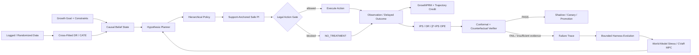

<div align="center">

# GrowthEvo-Harness

### Causal Decision Runtime for Autonomous User Growth

**把用户增长从「预测谁会转化」升级为「验证什么动作真正带来增量价值」。**

面向优惠触达、渠道选择、预算分配、召回与留存的 **因果决策、安全策略改进与 bounded Agent evolution runtime**。

[](https://www.python.org/)
[](https://github.com/jiaweine/GrowthEvo-Harness/actions/workflows/ci.yml)


`Causal POMDP` · `Cross-Fitted DR` · `Hierarchical Policy` · `Safe PI` · `IPS / DR OPE` · `Conformal Gate` · `GrowthPRM` · `Risk-Sensitive MPC` · `Harness Evolution`

**Incrementality first · Holdout is an action · Evidence before promotion · Evolution stays inside hard safety boundaries**

</div>

---

## Why GrowthEvo?

大多数增长系统优化的是：

> **谁最可能点击、购买或回流？**

GrowthEvo-Harness 优化的是另一个问题：

> **对这个用户，在这个时刻采取这个动作，相比什么都不做，是否真的会产生足够可信的增量收益？**

这两个问题并不等价。一个本来就会转化的用户，可能拥有很高的 conversion probability，却不应该被额外发券；一个短期点击率高的动作，也可能因为疲劳、预算消耗或长期 churn risk 而不值得执行。

因此，GrowthEvo 将用户增长建模为带 **预算、ROI、频控、疲劳、延迟反馈、logging-policy support 与部分可观测状态** 的 Causal POMDP，并把 `NO_TREATMENT` / holdout 作为一级动作。

| 常见方法 | 主要问题 | GrowthEvo 的处理 |
| --- | --- | --- |
| Propensity / conversion model | 预测会不会转化，不回答动作是否造成转化 | 显式估计 treatment uplift / CATE |
| Campaign rules | 能执行，但难证明策略比历史策略更好 | OPE + uncertainty + support-aware verification |
| Greedy policy optimization | 容易利用模型外推，在低 support 区域过度乐观 | Support-Anchored Safe Policy Improvement |
| Agent 自主修改策略 | 容易把“学习”与“裁判”混在一起 | Learning / Runtime / Verifier 分离 |
| 单步 reward | 难处理延迟反馈、rollback 和错误归因 | GrowthPRM + dynamics-aware credit boundary |

---

## What is implemented

GrowthEvo-Harness 不是单一 uplift model，也不是一个 campaign scheduler。它实现了一条从 **因果估计 → 策略决策 → 离线验证 → 轨迹信用分配 → bounded harness evolution** 的完整 reference runtime。

| Capability | Implementation | Code |
| --- | --- | --- |
| **Causal runtime** | Goal / belief state / event store / legal action / `NO_TREATMENT` | `growthevo/runtime/*` |
| **Causal estimation** | Cross-Fitted DR-Learner、CATE serving、support / uncertainty diagnostics | `growthevo/causal/*` |
| **Policy decisioning** | Hierarchical policy、support-anchored conservative improvement | `growthevo/rl/hierarchical_policy.py`, `growthevo/rl/safe_policy_improvement.py` |
| **Offline evidence** | IPS / DR / β*-IPS、ESS、support coverage、weight diagnostics | `growthevo/rl/ope.py` |
| **Deployment gate** | Split-conformal calibration + Counterfactual Verifier | `growthevo/rl/conformal.py`, `growthevo/verifier/*` |
| **Long-horizon risk** | stochastic rollout、CVaR、constraint violation、risk-sensitive MPC | `growthevo/rl/model_based.py` |
| **Agent credit** | GrowthPRM、GAE、rollback-aware credit boundary | `growthevo/rl/process_reward.py`, `growthevo/training/*` |
| **Harness evolution** | Failure Miner、bounded patch proposal、event-sourced evolution | `growthevo/evolution/*` |

> **Design rule:** learner 可以提出更优策略，但不能绕过 hard constraints，也不能修改 Verifier 的判定标准。

---

## Decision loop



核心闭环不是“模型给出最高分动作 → 直接执行”，而是：

```text
estimate incrementality
→ respect behavior support
→ generate a constrained candidate policy
→ verify value + risk + overlap evidence
→ promote only when evidence is sufficient
→ mine failures and evolve only whitelisted coordinates
```

---

## Quick Start

```bash
git clone https://github.com/jiaweine/GrowthEvo-Harness.git
cd GrowthEvo-Harness

python -m venv .venv
source .venv/bin/activate
pip install -e '.[dev]'

pytest
python examples/demo.py
```

Windows PowerShell:

```powershell
python -m venv .venv
.venv\Scripts\Activate.ps1
pip install -e '.[dev]'
pytest
python examples/demo.py
```

`examples/demo.py` 会串起一个最小闭环：

```text
GrowthGoal + constraints
→ UserObservation
→ Runtime decision
→ append-only event chain
→ GrowthPRM trajectory scoring
→ OPE diagnostics
→ conformal calibration
→ Counterfactual Verifier
```

如果想看 planner trajectory / training export，运行：

```bash
python examples/training_demo.py
```

---

## Minimal API example

```python
from growthevo.models import Channel, GrowthConstraints, GrowthGoal, UserObservation
from growthevo.runtime.engine import GrowthEvoRuntime

constraints = GrowthConstraints(
    max_budget=100.0,
    min_roi=1.5,
    max_fatigue=0.8,
    max_churn_risk=0.5,
)

goal = GrowthGoal(
    metric="incremental_ltv",
    horizon_days=30,
    target_delta=0.05,
    constraints=constraints,
)

observation = UserObservation(
    user_id="dormant-user",
    natural_conversion=0.18,
    channel_uplift={
        Channel.PUSH: 0.08,
        Channel.EMAIL: 0.04,
        Channel.IN_APP: 0.02,
    },
    uplift_uncertainty=0.05,
    ltv=120.0,
    fatigue=0.12,
    churn_risk=0.18,
    touches_24h=0,
    touches_7d=1,
    spend_to_date=10.0,
    days_since_last_active=45,
    lifecycle_stage="dormant",
    consented_channels=frozenset({Channel.PUSH, Channel.EMAIL, Channel.IN_APP}),
)

runtime = GrowthEvoRuntime()
result = runtime.run(goal, observation)

print(result)
print("event_chain_valid:", runtime.event_store.verify())
```

---

## Core contracts

### 1. Incrementality is the target

GrowthEvo 不把 raw conversion 当作 treatment value。对 action `a` 与 control `a₀ = NO_TREATMENT`：

$$
\tau(x,a)=\mathbb{E}[Y(a)-Y(a_0)\mid X=x].
$$

Runtime 的 belief state 同时保存 natural outcome、per-channel uplift、uncertainty 与 behavior-policy support，从而区分“用户本来会转化”与“动作造成了额外转化”。

### 2. `NO_TREATMENT` is a first-class action

合法动作空间是多重硬约束的交集：

$$
\mathcal{A}_{legal}(s)
=
\mathcal{A}_{registered}
\cap \mathcal{A}_{consent}
\cap \mathcal{A}_{budget}
\cap \mathcal{A}_{frequency}
\cap \mathcal{A}_{risk}.
$$

如果一个 treatment 被 hard gate 拒绝，Runtime 不会偷偷切换到另一个营销动作绕过约束，而是安全退回 `NO_TREATMENT`。

### 3. Policy improvement must stay near evidence

候选策略不会直接跳到模型 argmax。Safe PI 使用 pessimistic value，并锚定历史 behavior policy：

$$
\pi_{new}=(1-\eta)\mu+\eta\delta_{a^*}.
$$

`η` 同时受 behavior support、total-variation cap、expected-cost cap 与 pessimistic improvement 约束。

### 4. Promotion is an evidence decision

OPE 模块输出：

- IPS / Doubly Robust / estimated β*-IPS；
- estimator-specific standard error；
- ESS / ESS ratio；
- target-policy-mass weighted support coverage；
- max importance weight / weight CV。

Verifier 联合 value、ROI、spend、fatigue、churn risk、ESS、support coverage 与 importance-weight tail，只返回：

```text
PASS
FAIL
INSUFFICIENT_EVIDENCE
```

**高 point estimate + 差 overlap = 证据不足，而不是上线理由。**

### 5. Agent evolution is bounded

关键状态进入 append-only hash-chained event stream：

```text
GOAL_COMPILED
BELIEF_UPDATED
HYPOTHESIS_PLANNED
ACTION_PROPOSED
ACTION_ALLOWED / ACTION_BLOCKED
FEEDBACK_OBSERVED
REWARD_ASSIGNED
PROCESS_REWARD_ASSIGNED
VERIFICATION_COMPLETED
FAILURE_CLASSIFIED
PATCH_PROPOSED
```

Evolver 只能修改 whitelisted cognitive coordinates，例如 planner template、feature / memory / tool routing、delegation、exploration 与 short-horizon reward shaping。

以下边界保持冻结：

```text
North-Star Metric
Consent
Budget Ledger
Event Store
Verifier
Deployment Gate
NO_TREATMENT semantics
```

---

## Evaluation

项目评测覆盖三个互补层次：CATE 估计、uplift ranking 与 logged-bandit OPE。

| Benchmark | Purpose | Reported result | Evidence status |
| --- | --- | ---: | --- |
| **GrowthAgentBench** | known-ground-truth CATE + oracle policy regression | CATE RMSE **0.026** · Oracle Regret **0.013** | synthetic fixture included in core repo |
| **Criteo Uplift v2** | uplift ranking / top-decile treatment-effect quality | Uplift@10% **+6.8%** | project evaluation record |
| **Open Bandit Dataset** | logged-bandit off-policy evaluation | OPE Error **-8.4%** | project evaluation record |

最小仓库内自带的可审计 benchmark 是 `GrowthAgentBench`：它提供已知 heterogeneous treatment effects、context-dependent behavior propensities 与 oracle potential outcomes，用于回归 CATE / policy quality。

```python
from growthevo.bench import GrowthAgentBench
from growthevo.models import Channel

bench = GrowthAgentBench.synthetic(sample_size=1200, seed=17)
model, metrics = bench.fit_cate(treatment=Channel.PUSH)
print(metrics)
```

> Public benchmark 数字应理解为项目 evaluation record；核心仓库不把外部数据集结果伪装成 production evidence。详细证据边界见 [`docs/IMPLEMENTATION_STATUS.md`](docs/IMPLEMENTATION_STATUS.md)。

---

## Safety invariants

GrowthEvo 把以下原则视为 runtime contract，而不是可选的训练技巧：

1. **Incrementality first** — 优化 treatment effect，而不是 raw conversion。
2. **Support before optimism** — out-of-support 动作不能靠 value extrapolation 获得虚假优势。
3. **Holdout is an action** — `NO_TREATMENT` 永远是一级动作。
4. **Hard gate cannot be bypassed** — 被拒绝的动作不能通过换渠道绕过同一步约束。
5. **Execution is not promotion** — 能执行不代表证据足以上线。
6. **Verifier is immutable to the learner** — learner 不能修改自己的部署裁判。
7. **Rollback-aware credit** — advantage 不跨错误动力学边界传播。
8. **Evolution is bounded** — Harness 可以演进，但 hard safety / evidence boundary 保持冻结。

---

## Repository layout

```text
GrowthEvo-Harness/
├── growthevo/
│   ├── bench/          # synthetic causal / policy regression fixtures
│   ├── causal/         # DR learner + CATE serving
│   ├── runtime/        # belief, planner, legal-action gate, engine, event store
│   ├── rl/             # policy, OPE, conformal, process reward, model-based safety
│   ├── training/       # trajectory adapters / credit assignment / export
│   ├── verifier/       # counterfactual promotion gate
│   ├── simulator/      # user world model
│   ├── evolution/      # failure mining + bounded harness patching
│   └── tools/          # tool registry
├── examples/
│   ├── demo.py
│   └── training_demo.py
├── tests/
├── docs/
└── .github/workflows/ci.yml
```

---

## What this project is — and is not

### Good fit

- 需要区分 **自然转化** 与 **增量转化** 的优惠 / CRM / lifecycle decisioning；
- 有 logged / randomized interaction data，希望做 conservative policy improvement；
- 需要预算、ROI、频控、fatigue、churn 等 hard constraints；
- 希望把 agent planner 与统计验证 / deployment gate 分离；
- 研究 offline RL、causal decisioning、agent credit assignment 或 safe self-evolution。

### Not intended as

- 开箱即用的生产营销平台；
- 已校准好的 production world model；
- 对任意新动作进行无 support 的安全外推器；
- 允许 agent 自主修改安全约束、Verifier 或 North-Star Metric 的 self-modifying system。

当前 `v0.1.0` 更适合作为 **auditable reference implementation / research harness**：核心 decision contracts、OPE、Verifier、trajectory credit 与 bounded evolution 已实现；线上 shadow / canary / rollback 基础设施、生产级 world-model calibration 以及 IQL / CQL / neural uplift backend 属于扩展边界。

---

## Extension points

Runtime contract 与算法 backend 刻意解耦，可以替换或接入：

```text
CausalML / EconML / neural uplift
IQL / CQL / other sequential offline-RL backends
PPO / GRPO / Agent-RL planner post-training
production feature / event / experimentation systems
shadow / canary / rollback deployment infrastructure
world-model calibration + rollout-error diagnostics
```

扩展 backend 不应改变 causal state、legal-action、OPE、Verifier、event sourcing 与 `NO_TREATMENT` 的语义。

---

## Documentation

- [`docs/ARCHITECTURE.md`](docs/ARCHITECTURE.md) — Runtime、Learning、Verifier 与模块边界
- [`docs/ALGORITHM.md`](docs/ALGORITHM.md) — 因果估计、OPE、Safe PI 与策略安全
- [`docs/TRAINING_AND_BENCHMARK.md`](docs/TRAINING_AND_BENCHMARK.md) — trajectory training 与 benchmark
- [`docs/FRONTIER_2026.md`](docs/FRONTIER_2026.md) — 研究方向与扩展
- [`docs/IMPLEMENTATION_STATUS.md`](docs/IMPLEMENTATION_STATUS.md) — 已实现能力、工程边界与证据规则

---

<div align="center">

### GrowthEvo-Harness

**Causal decisioning · Verifiable policy improvement · Bounded agent evolution**

*Optimize what your action changes — not merely what your model predicts.*

</div>
