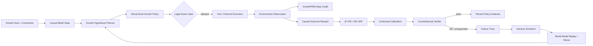

<div align="center">

# GrowthEvo-Harness

### Causal Reinforcement Learning Runtime for Autonomous User Growth

**让 Growth Agent 在因果增量、预算约束与可回滚边界内自主做增长决策，并从失败与分布漂移中安全演进。**

`CAUSAL POMDP` · `HIERARCHICAL RL` · `β*-IPS / DR OPE` · `CONFORMAL GATE` · `GROWTHPRM` · `RISK-SENSITIVE MPC` · `WORLD MODEL` · `HARNESS EVOLUTION`

</div>

---

## Product Thesis

传统营销自动化回答的是“执行什么活动”；GrowthEvo 关注的是更难的问题：

> **对谁、什么时候、通过什么渠道、给什么权益或内容、投入多少预算，以及什么时候应该什么都不做。**

GrowthEvo-Harness 将用户增长建模为带预算、ROI、触达频控、用户疲劳和延迟反馈约束的 **Causal POMDP**。LLM/Planner 负责增长假设、分群、工具与子任务规划；RL Policy 负责渠道、权益、时机和预算等数值决策；Counterfactual Verifier 只在增量价值、日志策略覆盖和风险证据都足够时允许策略晋级。

核心目标不是 raw conversion，而是 **incremental outcome**：

\[
\tau(x,a)=\mathbb E[Y(a)-Y(a_0)\mid X=x]
\]

其中 `a0 = NO_TREATMENT`。如果一个用户本来就会购买，系统应学会不发券、不打扰、节省预算。

---

## Runtime Loop



GrowthEvo 使用两个学习时间尺度：

1. **Fast loop — Growth Policy Learning**：针对当前用户与增长目标学习 `target / channel / offer / timing / budget / no-treatment`。
2. **Slow loop — Harness Evolution**：从错误归因、预算浪费、疲劳、工具失败和分布漂移中修正 Planner、Memory、Reward Shaping、Feature Routing 与 Exploration 参数；安全内核和 North-Star Metric 保持冻结。

---

## Core Learning Stack

### 1. CausalLift-HRL · Hierarchical Growth Policy

GrowthEvo 使用层次策略：

\[
\pi_H(z_t\mid b_t,g)
\]

先选择增长 option：

`ACQUIRE / ACTIVATE / RETAIN / REACTIVATE / UPSELL / EXPLORE / HOLDOUT / STOP`

再由动作策略：

\[
\pi_A(a_t\mid b_t,z_t)
\]

选择具体增长干预：

`channel + offer + timing + creative + budget + frequency cap`。

Outcome reward 不直接奖励“转化”，而奖励估计的因果增量，并扣除成本、疲劳、风险与不确定性：

\[
r_t=w_1\hat\tau^{LTV}_t+w_2\hat\tau^{Retention}_t+w_3\hat\tau^{Conversion}_t
-\lambda_1 Cost_t-\lambda_2 Fatigue_t-\lambda_3 Risk_t-\lambda_4 Uncertainty_t
\]

当前仓库提供一个可运行、模型无关的 reference policy，用于验证 Runtime 契约。它不是伪装成已经训练好的 IQL/CQL/GRPO；后续训练 backend 可以替换 policy implementation，但不改变事件、权限和验证语义。

### 2. β*-IPS / DR OPE + Overlap Diagnostics

除了 IPS 与 Doubly-Robust，Runtime 实现 estimated β*-IPS additive control variate：

\[
\hat V_{\beta}=
\frac1n\sum_i\left[w_i r_i-\hat\beta(w_i-1)\right],
\qquad
\hat\beta=\frac{\widehat{Cov}(w r,w-1)}{\widehat{Var}(w-1)}
\]

Policy Evidence 同时包含：

- IPS / DR / β*-IPS；
- estimator-specific standard error；
- Effective Sample Size / ESS ratio；
- logging-policy support coverage；
- max importance weight；
- importance-weight coefficient of variation。

**收益高但 logging policy 没覆盖的候选策略不会被晋级。** 缺乏 support 时，Verifier 返回 `INSUFFICIENT_EVIDENCE`，而不是制造一个不可信的离线提升结论。

### 3. Split-Conformal Promotion Gate

历史 shadow / canary cohort 成熟后，使用预测与真实结果之间的一侧 residual quantile 形成 calibration margin：

\[
LCB_{conf}(\Delta V)=\widehat{\Delta V}-q_{1-\alpha}(\widehat{\Delta V}-\Delta V)
\]

实现中明确区分：

- `value_lower_margin / roi_lower_margin`：残差 margin；
- `spend_upper_margin / fatigue_upper_margin / churn_risk_upper_margin`：残差 margin；
- `value_lcb / roi_lcb / spend_ucb / ...`：margin 应用于新预测后得到的实际 bound。

Verifier 对 value 取统计 LCB 与 conformal LCB 中更保守的一侧；ROI 使用 lower bound，Spend / Fatigue / Churn 使用 upper bound。校准不会让 gate 比原始统计门槛更激进。

> Split-conformal 的有限样本 coverage 依赖 calibration cohort 与未来 cohort 的 exchangeability。检测到 distribution shift 时应 recalibrate 或 abstain，而不是把 conformal 当作 shift-proof 保证。

### 4. GrowthPRM · Observation-Grounded Process Reward

最终转化或 D30 LTV 太稀疏，无法给长链 Planner 足够 credit。`GrowthProcessRewardModel` 对每一步计算：

\[
r_t^{proc}
=
\gamma\Phi(s_{t+1})-\Phi(s_t)
+\lambda_{obs}(1-H(a_t))\Delta Evidence_t
-Cost_t-Penalty_t
\]

其中 `Φ` 由 Goal Progress、Evidence Quality 与 Constraint Slack 构成。环境 observation 真正减少不确定性时才获得额外 credit；失败工具、重复证据、直接成本和不可逆副作用都有显式负向 credit。

Process reward 与 terminal business outcome 分开记录，因此训练层可以区分“中间决策质量”和“最终业务结果”。

### 5. Risk-Sensitive Model-Based Planning

`RiskSensitiveMPC` 在长周期 World Model 上对候选增长计划做多 seed rollout，并用 downside CVaR 与 constraint violation rate 排序：

\[
Score(plan)=CVaR_{\alpha}(Return)-\lambda P(ConstraintViolation)
\]

Stress scenario 可以同时：

- 压低 treatment uplift；
- 抬高 channel / offer cost；
- 放大 fatigue；
- 累积预算、触达次数与 churn risk。

这个模块只用于 replay / stress test / candidate ranking。**Simulator 不是 ground truth，也不能单独作为 policy promotion 证据。**

---

## Causal Belief State

用户真正的购买意图、价格敏感度和疲劳程度不可完全观测，因此 Runtime 维护 Causal Belief State，而不是只存聊天上下文。

典型状态包括：

| State | Meaning |
|---|---|
| Natural conversion | 无干预时的基础转化倾向 |
| Channel uplift | 各渠道 treatment effect 估计 |
| Uplift uncertainty | 因果效果不确定性 |
| LTV | 长期价值估计 |
| Fatigue | 历史触达带来的疲劳状态 |
| Churn risk | 退订 / 流失风险 |
| Touch counts | 24h / 7d 触达次数 |
| Spend | 当前预算消耗 |
| Lifecycle | acquire / active / dormant 等生命周期阶段 |
| Consent | 用户允许的渠道集合 |

关键不变量是：

> **自然转化概率和 treatment uplift 永远不是同一个字段。**

一个自然转化概率 0.95、uplift 只有 0.001 的用户，不应因为“看起来很容易转化”而被发券。

---

## Legal Action Space Before Learning

Policy 只能从合法动作集合中学习：

\[
\mathcal A_{legal}(s)=
\mathcal A_{registered}
\cap\mathcal A_{consent}
\cap\mathcal A_{budget}
\cap\mathcal A_{frequency}
\cap\mathcal A_{risk}
\]

硬约束包括：

- Consent / suppression；
- max budget；
- max offer value；
- 24h / 7d frequency cap；
- max fatigue；
- max churn risk。

被硬约束拒绝的 treatment 不会在同一步偷偷换一个“次优营销动作”继续执行。Runtime 安全降级到 `HOLDOUT / NO_TREATMENT`。

---

## Counterfactual Verification

策略晋级不是比较 raw mean，而是同时检查 value、support 与 business constraints：

\[
LCB(V(\pi_{candidate})-V(\pi_{baseline})) > \delta
\]

并满足：

\[
UCB(C_j(\pi_{candidate})) \le c_j
\]

Reference implementation 支持：

- IPS / Doubly-Robust / β*-IPS value estimate；
- estimator-specific standard errors；
- ESS / ESS ratio；
- logging support coverage / importance-weight tail gate；
- asymptotic LCB ∩ split-conformal LCB；
- calibrated ROI lower bound；
- calibrated budget / fatigue / churn upper bounds；
- `PASS / FAIL / INSUFFICIENT_EVIDENCE`。

因此以下三种状态严格分离：

1. **策略差**：证据充分，但 candidate 未优于 baseline 或违反业务约束；
2. **证据不足**：样本、ESS 或 overlap 不足；
3. **策略通过**：价值下界与所有风险边界均通过。

---

## Event-Sourced Growth Decisions

所有关键状态变化写入 append-only hash chain：

```text
GOAL_COMPILED
BELIEF_UPDATED
HYPOTHESIS_PLANNED
ACTION_PROPOSED
ACTION_ALLOWED / ACTION_BLOCKED
FEEDBACK_OBSERVED
REWARD_ASSIGNED
PROCESS_REWARD_ASSIGNED
ROLLOUT_EVALUATED
VERIFICATION_COMPLETED
FAILURE_CLASSIFIED
PATCH_PROPOSED
```

事件 hash 绑定前序 hash 与 payload，用于检测历史漂移，并为 replay、OPE、Agent-RL credit 与 Harness Evolution 提供统一事实源。

单用户执行和 cohort-level policy verification 是两个不同阶段，但两者写入同一个 Event Store。

---

## Harness Evolution

### Frozen kernel

以下组件不能被 Evolver 修改：

- North-Star Metric 与主指标定义；
- Consent / suppression / frequency-cap；
- Budget Ledger；
- Event Store；
- Counterfactual Verifier；
- Deployment / Promotion Gate；
- `NO_TREATMENT / HOLDOUT` 语义。

### Evolvable coordinates

候选 patch 只允许作用于：

- Planner hypothesis template；
- Feature routing；
- Memory retrieval policy；
- Tool routing；
- Delegation / sub-agent strategy；
- Exploration coefficient；
- Short-horizon reward shaping。

这保证 Evolver 不能通过“修改裁判”制造虚假的策略提升。

---

## Repository Layout

```text
GrowthEvo-Harness/
├── growthevo/
│   ├── models.py                  # shared contracts + policy evidence
│   ├── runtime/
│   │   ├── belief_state.py        # causal belief reducer
│   │   ├── event_store.py         # append-only hash-chained event log
│   │   ├── legal_action.py        # budget / consent / fatigue gate
│   │   ├── planner.py             # growth hypothesis planner
│   │   └── engine.py              # interaction + PRM + verification events
│   ├── rl/
│   │   ├── causal_reward.py       # incremental outcome reward
│   │   ├── hierarchical_policy.py # option + numeric action policy
│   │   ├── ope.py                 # IPS / DR / β*-IPS + overlap diagnostics
│   │   ├── conformal.py           # split-conformal residual margins
│   │   ├── process_reward.py      # GrowthPRM observation-grounded credit
│   │   └── model_based.py         # CVaR risk-sensitive MPC / stress rollout
│   ├── verifier/
│   │   └── counterfactual.py      # calibrated value + constraint gate
│   ├── simulator/
│   │   └── user_world_model.py    # stochastic delayed-feedback digital twin
│   ├── evolution/
│   │   ├── failure_miner.py       # typed failure classification
│   │   └── optimizer.py           # bounded declarative patch proposal
│   └── tools/
│       └── registry.py            # typed growth tool registry
├── examples/demo.py
├── tests/
├── docs/
│   ├── ARCHITECTURE.md
│   ├── ALGORITHM.md
│   ├── FRONTIER_2026.md
│   └── IMPLEMENTATION_STATUS.md
└── .github/workflows/ci.yml
```

---

## Quick Start

```bash
git clone https://github.com/jiaweine/GrowthEvo-Harness.git
cd GrowthEvo-Harness
python -m venv .venv
source .venv/bin/activate
pip install -e '.[dev]'
python examples/demo.py
pytest
```

Demo 会执行：

```text
Goal compile
  → Causal Belief
  → Growth option + numeric action
  → Legal Action Gate
  → World Model observation
  → Causal outcome reward
  → GrowthPRM process credit
  → β*-IPS / DR OPE + overlap diagnostics
  → Split-conformal calibration
  → Counterfactual policy gate
  → Event persistence
```

---

## 2026 Research Alignment

`docs/FRONTIER_2026.md` 明确区分 **research signal / code mapping / claims boundary**。当前实现重点对齐：

- **SIGIR 2026 — Additive Control Variates Dominate Self-Normalisation in OPE**：β*-IPS / additive control variate；
- **WWW 2026 — Auto-bidding under RoS Constraints with Uncertainty Quantification**：conformal uncertainty + business constraints；
- **WWW 2026 — DARA / LBM**：高层语义 reasoning 与低层精确 numeric decision 分离；
- **ACL 2026 — SOAR**：environment observation 作为 Agent-RL credit signal；
- **ACL Findings 2026 — ToolPRMBench / AgentV-RL**：tool-process reward 与 verifier learning；
- **SIGIR 2026 — SmartSearch / Tool-Star**：process reward、local refinement 与 multi-tool RL；
- **SIGIR 2026 — Verifiable User Simulation**：Simulator 必须可审计，不能把 synthetic return 当真实因果证据。

---

## Evaluation Plan

仓库当前**不声明虚构的线上提升数字**。实验层计划使用公开 logged-bandit / uplift 数据与可控 simulator 构建 `GrowthAgentBench`，覆盖：

- Cold-start acquisition；
- Multi-channel budget allocation；
- Coupon / incentive optimization；
- Retention with fatigue；
- Dormant-user reactivation；
- Delayed conversion；
- Distribution shift；
- Tool failure / missing evidence；
- support mismatch / propensity shift；
- world-model stress / long-horizon constraint violation。

建议 baseline：

`Rule → ReAct → LinUCB/Thompson → Uplift/DR Policy → IQL/CQL → GRPO-only Planner → CausalLift-HRL → + Conformal Gate → + GrowthPRM → + Harness Evolution`

指标包括：

- AUUC / Qini / Incremental Conversion；
- Incremental LTV / CAC / ROAS；
- Policy Value / Regret；
- OPE estimator error / CI coverage；
- ESS ratio / support coverage；
- ROI / Budget violation rate；
- D7 / D30 retention；
- Fatigue / unsubscribe proxy；
- CVaR return / rollout violation rate；
- tool calls / latency / cost；
- distribution-shift recovery；
- evolution promotion / regression rate。

---

## Design Principles

1. **Incrementality before conversion** — 优先回答“是否因为干预才发生”。
2. **Legal action space before learning** — 不允许的动作不会因为模型置信度高而进入策略空间。
3. **Overlap before OPE confidence** — 没有 logging-policy support，就没有可信的离线策略提升。
4. **Offline evidence before online exploration** — 优先使用 logged data、OPE、calibration 与 simulator 降低探索风险。
5. **No-treatment is a real action** — 不营销也是增长策略。
6. **Planner and numeric policy are separable** — LLM 负责语义规划，RL 负责可校验数值决策。
7. **Observation is a learning signal** — PRM 奖励环境反馈带来的真实进展，而不是长推理文本。
8. **Simulator is not ground truth** — World Model 用于 replay/stress，不替代真实 holdout 与 OPE。
9. **Evidence is not prose** — Verifier 使用 propensity、outcome、constraint 与 policy evidence，不把模型措辞当证据。
10. **Evolution cannot rewrite the judge** — Evolver 不能修改 Verifier、North-Star Metric 或安全边界。

---

## Implementation Status

当前仓库已经实现：

- Causal Belief + hierarchical policy contracts；
- first-class `NO_TREATMENT`；
- hard legal-action gate；
- hash-chained Event Store；
- incremental causal reward；
- IPS / DR / β*-IPS OPE；
- overlap / propensity-tail diagnostics；
- split-conformal residual calibration；
- support-aware Counterfactual Verifier；
- GrowthPRM process reward；
- risk-sensitive CVaR model-based rollout；
- long-horizon fatigue / churn / budget transitions；
- bounded Harness Evolution。

下一步只在有真实可复现实验后增加结果性声明。更详细边界见 `docs/IMPLEMENTATION_STATUS.md`。

---

## Disclaimer

GrowthEvo-Harness is a research and engineering project for studying autonomous growth decision systems. Real marketing deployment requires product-specific consent, privacy, experimentation, anti-abuse and regulatory controls.
