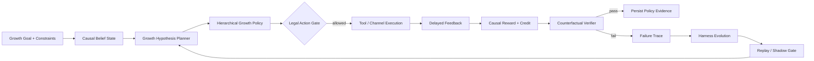

<div align="center">

# GrowthEvo-Harness

### Causal Reinforcement Learning Runtime for Autonomous User Growth

**让 Growth Agent 在因果增量、预算约束与可回滚边界内自主做增长决策，并从失败与分布漂移中安全演进。**

`CAUSAL BELIEF` · `HIERARCHICAL RL` · `OFFLINE / CONSTRAINED RL` · `OPE` · `COUNTERFACTUAL VERIFIER` · `WORLD MODEL` · `MCP / TOOL RUNTIME` · `HARNESS EVOLUTION`

</div>

---

## Product Thesis

传统营销自动化回答的是“执行什么活动”；GrowthEvo 关注的是更难的问题：

> **对谁、什么时候、通过什么渠道、给什么权益或内容、投入多少预算，以及什么时候应该什么都不做。**

GrowthEvo-Harness 将用户增长建模为带预算、ROI、触达频控、用户疲劳和延迟反馈约束的 **Causal POMDP**。LLM/Planner 负责增长假设、分群、工具与子任务规划；RL Policy 负责渠道、权益、时机和预算等决策；Counterfactual Verifier 只在增量价值和约束证据足够时允许策略晋级。

核心目标不是 raw conversion，而是 **incremental outcome**：

\[
\tau(x,a)=\mathbb E[Y(a)-Y(a_0)\mid X=x]
\]

其中 `a0 = NO_TREATMENT`。如果一个用户本来就会购买，系统应学会不发券、不打扰、节省预算。

---

## Runtime Loop



### Two-timescale learning

GrowthEvo 把学习分成两个时间尺度：

1. **Fast loop — Growth Policy Learning**：针对当前用户与增长目标学习 `target / channel / offer / timing / budget / no-treatment`。
2. **Slow loop — Harness Evolution**：从错误归因、预算浪费、疲劳、工具失败和分布漂移中修改 Planner、Memory、Reward Shaping、Feature Routing 与 Exploration 参数；安全内核和 North-Star Metric 保持冻结。

---

## Core Algorithm · CausalLift-HRL

GrowthEvo 使用层次策略：

\[
\pi_H(z_t\mid b_t,g)
\]

先选择增长 option：

`ACQUIRE / ACTIVATE / RETAIN / REACTIVATE / UPSELL / EXPLORE / HOLDOUT / STOP`

再由动作策略：

\[
\pi_A(a_t\mid b_t,z_t)
\]

选择具体增长干预：

`channel + offer + timing + creative + budget + frequency cap`。

奖励函数不直接奖励“转化”，而奖励估计的因果增量，并扣除成本、疲劳、风险与不确定性：

\[
r_t=w_1\hat\tau^{LTV}_t+w_2\hat\tau^{Retention}_t+w_3\hat\tau^{Conversion}_t
-\lambda_1 Cost_t-\lambda_2 Fatigue_t-\lambda_3 Risk_t-\lambda_4 Uncertainty_t
\]

当前仓库提供一个**可运行、模型无关的 reference policy**，用于验证 Runtime 契约。后续可将 policy backend 替换为 IQL/CQL、CPO/Lagrangian、Thompson Sampling、GRPO planner 或外部训练服务，而不改变事件与验证语义。

---

## Safety Invariants

### Frozen kernel

以下组件不能被 Evolver 修改：

- North-Star Metric 与实验主指标定义
- Consent / suppression / frequency-cap 等用户边界
- Budget Ledger 与硬预算
- Event Store 与审计事实
- Counterfactual Verifier
- Deployment / Promotion Gate
- `NO_TREATMENT` / holdout 语义

### Evolvable coordinates

候选 patch 只允许作用于：

- Planner hypothesis template
- Feature routing
- Memory retrieval policy
- Tool routing
- Delegation / sub-agent strategy
- Exploration coefficient
- Short-horizon reward shaping

这避免了通过修改指标或安全门禁制造“虚假的策略提升”。

---

## Repository Layout

```text
GrowthEvo-Harness/
├── growthevo/
│   ├── models.py                 # shared domain contracts
│   ├── runtime/
│   │   ├── belief_state.py       # causal belief reducer
│   │   ├── event_store.py        # append-only hash chained event log
│   │   ├── legal_action.py       # budget / consent / fatigue gate
│   │   ├── planner.py            # growth hypothesis planner
│   │   └── engine.py             # end-to-end runtime loop
│   ├── rl/
│   │   ├── causal_reward.py      # incremental reward decomposition
│   │   ├── hierarchical_policy.py# option + action policy
│   │   └── ope.py                # IPS / DR off-policy evaluation
│   ├── verifier/
│   │   └── counterfactual.py     # value-LCB + constraint verification
│   ├── simulator/
│   │   └── user_world_model.py   # stochastic delayed-feedback world model
│   ├── evolution/
│   │   ├── failure_miner.py      # typed failure classification
│   │   └── optimizer.py          # bounded declarative patch proposal
│   └── tools/
│       └── registry.py           # typed growth tool registry
├── examples/demo.py
├── tests/
├── docs/
└── .github/workflows/ci.yml
```

---

## Quick Start

```bash
git clone https://github.com/jiaweine/GrowthEvo-Harness.git
cd GrowthEvo-Harness
python -m venv .venv
source .venv/bin/activate
pip install -e '.[dev]'
python examples/demo.py
pytest
```

Demo 会执行：

```text
Goal compile
  → Causal Belief
  → Growth option selection
  → Legal Action Gate
  → World Model feedback
  → Causal reward
  → Counterfactual verification
  → Event persistence
```

---

## Decision Contract

一个 Growth action 不是任意字典，而是明确的决策合同：

```python
GrowthAction(
    option=GrowthOption.REACTIVATE,
    channel=Channel.PUSH,
    offer_value=6.0,
    budget=0.08,
    frequency_cost=1.0,
    expected_uplift=0.06,
    uncertainty=0.02,
)
```

`NO_TREATMENT` 是一级动作；对高自然转化、低 uplift 或高 fatigue 用户，Policy 可以主动 abstain。

---

## Counterfactual Verification

策略晋级不是比较 raw mean，而是验证保守置信边界：

\[
LCB(V(\pi_{candidate})-V(\pi_{baseline})) > \delta
\]

同时满足：

\[
UCB(C_j(\pi_{candidate})) \le c_j
\]

Reference implementation 支持：

- IPS value estimate
- Doubly-Robust value estimate
- effective sample size
- uncertainty-aware lower confidence bound
- ROI / budget / fatigue constraints
- insufficient-evidence abstention

因此“证据不足”与“策略失败”是不同状态。

---

## Event-Sourced Growth Decisions

所有关键状态变化写入 append-only hash chain：

```text
GOAL_COMPILED
BELIEF_UPDATED
HYPOTHESIS_PLANNED
ACTION_PROPOSED
ACTION_ALLOWED / ACTION_BLOCKED
FEEDBACK_OBSERVED
REWARD_ASSIGNED
VERIFICATION_COMPLETED
FAILURE_CLASSIFIED
PATCH_PROPOSED
```

事件 hash 同时绑定前序 hash 与 payload，允许检测历史漂移，并为后续 replay、OPE 和 evolution 提供统一事实源。

---

## Evaluation Plan

仓库当前**不声明虚构的线上提升数字**。计划使用公开 logged-bandit / uplift 数据与可控 simulator 构建 `GrowthAgentBench`，覆盖：

- Cold-start acquisition
- Multi-channel budget allocation
- Coupon / incentive optimization
- Retention with fatigue
- Dormant-user reactivation
- Delayed conversion
- Distribution shift
- Tool failure / missing evidence

建议 baseline：

`Rule → ReAct → LinUCB/Thompson → Uplift/DR Policy → IQL/CQL → GRPO-only Planner → CausalLift-HRL → CausalLift-HRL + Harness Evolution`

指标包括：

- AUUC / Qini / Incremental Conversion
- Incremental LTV / CAC / ROAS
- Policy Value / Regret
- ROI / Budget violation rate
- D7 / D30 retention
- Fatigue / unsubscribe proxy
- OPE error / effective sample size
- tool calls / latency / cost
- distribution-shift recovery
- evolution promotion / regression rate

---

## Design Principles

1. **Incrementality before conversion** — 优先回答“是否因为干预才发生”。
2. **Legal action space before learning** — 不允许的动作不会因为模型置信度高而进入策略空间。
3. **Offline evidence before online exploration** — 优先使用 logged data、OPE 和 simulator 降低探索风险。
4. **No-treatment is a real action** — 不营销也是增长策略。
5. **Planner and numeric policy are separable** — LLM 负责语义规划，RL 负责可校验决策。
6. **Evidence is not prose** — Verifier 使用 propensity、outcome、constraint 与 policy evidence，不把模型措辞当证据。
7. **Evolution cannot rewrite the judge** — Evolver 不能修改 Verifier、North-Star Metric 或安全边界。

---

## Status

`v0.1` focuses on the runtime kernel and algorithm contracts. It is intentionally small enough to audit and extend. Planned next milestones:

- pluggable offline-RL backend
- delayed-credit / process reward model
- MCP adapters for CRM / Ads / Experiment systems
- logged-bandit dataset adapters
- replay + shadow promotion pipeline
- GrowthAgentBench
- experiment dashboard

---

## Disclaimer

GrowthEvo-Harness is a research and engineering project for studying autonomous growth decision systems. Real marketing deployment requires product-specific consent, privacy, experimentation, anti-abuse and regulatory controls.
