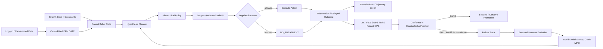

<div align="center">

# GrowthEvo-Harness

### Causal Decision Runtime for Autonomous User Growth

**把用户增长从「预测谁会转化」升级为「验证什么动作真正带来增量价值」。**

面向优惠触达、渠道选择、预算分配、召回与留存的 **因果决策、安全策略改进与 bounded Agent evolution runtime**。

[](https://www.python.org/)
[](https://github.com/jiaweine/GrowthEvo-Harness/actions/workflows/ci.yml)


`Causal POMDP` · `Cross-Fitted DR` · `Hierarchical Policy` · `Support-Anchored PI` · `Robust OPE` · `Conformal Gate` · `GrowthPRM` · `Risk-Sensitive MPC` · `Harness Evolution`

**Incrementality first · Holdout is an action · Evidence before promotion · Evolution stays inside hard safety boundaries**

</div>

---

## Why GrowthEvo?

大多数增长系统优化的是：

> **谁最可能点击、购买或回流？**

GrowthEvo-Harness 优化的是另一个问题：

> **对这个用户，在这个时刻采取这个动作，相比什么都不做，是否真的会产生足够可信的增量收益？**

这两个问题并不等价。一个本来就会转化的用户，可能拥有很高的 conversion probability，却不应该被额外发券；一个短期点击率高的动作，也可能因为疲劳、预算消耗或长期 churn risk 而不值得执行。

因此，GrowthEvo 将用户增长建模为带 **预算、ROI、频控、疲劳、延迟反馈、logging-policy support 与部分可观测状态** 的 Causal POMDP，并把 `NO_TREATMENT` / holdout 作为一级动作。

| 常见方法 | 主要问题 | GrowthEvo 的处理 |
| --- | --- | --- |
| Propensity / conversion model | 预测会不会转化，不回答动作是否造成转化 | 显式估计 treatment uplift / CATE |
| Campaign rules | 能执行，但难证明策略比历史策略更好 | OPE + uncertainty + support-aware verification |
| Greedy policy optimization | 容易利用模型外推，在低 support 区域过度乐观 | Support-Anchored Safe Policy Improvement |
| Agent 自主修改策略 | 容易把“学习”与“裁判”混在一起 | Learning / Runtime / Verifier 分离 |
| 单步 reward | 难处理延迟反馈、rollback 和错误归因 | GrowthPRM + dynamics-aware credit boundary |

---

## What is implemented

GrowthEvo-Harness 不是单一 uplift model，也不是 campaign scheduler。它实现了一条从 **因果估计 → 策略决策 → 离线验证 → 轨迹信用分配 → bounded harness evolution** 的 reference runtime，并提供真实数据 benchmark plumbing。

| Capability | Implementation | Code |
| --- | --- | --- |
| **Causal runtime** | Goal / belief state / event store / legal action / `NO_TREATMENT` | `growthevo/runtime/*` |
| **Causal estimation** | Cross-Fitted DR-Learner、CATE serving、support / uncertainty diagnostics | `growthevo/causal/*` |
| **Policy decisioning** | Hierarchical policy、support-anchored conservative improvement | `growthevo/rl/hierarchical_policy.py`, `growthevo/rl/safe_policy_improvement.py` |
| **Offline evidence** | DM / IPS / SNIPS / DR / SWITCH-DR / DR-OS、ESS、support / weight diagnostics | `growthevo/rl/ope.py` |
| **Deployment gate** | Split-conformal calibration + Counterfactual Verifier | `growthevo/rl/conformal.py`, `growthevo/verifier/*` |
| **Long-horizon risk** | stochastic rollout、CVaR、constraint violation、risk-sensitive MPC | `growthevo/rl/model_based.py` |
| **Agent credit** | GrowthPRM、GAE、rollback-aware credit boundary | `growthevo/rl/process_reward.py`, `growthevo/training/*` |
| **Real-data adapters** | Criteo Uplift、Open Bandit Dataset、KuaiRand sequence export | `growthevo/bench/*` |
| **Harness evolution** | Failure Miner、bounded patch proposal、event-sourced evolution | `growthevo/evolution/*` |

> **Design rule:** learner 可以提出更优策略，但不能绕过 hard constraints，也不能修改 Verifier 的判定标准。

---

## Decision loop



核心闭环不是“模型给出最高分动作 → 直接执行”，而是：

```text
estimate incrementality
→ respect behavior support
→ generate a constrained candidate policy
→ verify value + risk + overlap evidence
→ promote only when evidence is sufficient
→ mine failures and evolve only whitelisted coordinates
```

---

## Quick Start

```bash
git clone https://github.com/jiaweine/GrowthEvo-Harness.git
cd GrowthEvo-Harness

python -m venv .venv
source .venv/bin/activate
pip install -e '.[dev]'

pytest
python examples/demo.py
python examples/training_demo.py
```

Windows PowerShell:

```powershell
python -m venv .venv
.venv\Scripts\Activate.ps1
pip install -e '.[dev]'
pytest
python examples/demo.py
python examples/training_demo.py
```

`examples/demo.py` 会串起一个最小闭环：

```text
GrowthGoal + constraints
→ UserObservation
→ explicit execution environment + reward utility
→ Runtime decision
→ append-only event chain
→ GrowthPRM trajectory scoring
→ OPE diagnostics
→ conformal calibration
→ Counterfactual Verifier
```

### Minimal execution example

Runtime 执行是 **fail-closed** 的：仓库不会替调用方静默选择 synthetic environment 或业务 reward scalarization。下面的 simulator 和 net-value utility 只是显式的 reference/demo 选择。

```python
from growthevo.models import Channel, GrowthConstraints, GrowthGoal, UserObservation
from growthevo.rl.causal_reward import CausalRewardModel, RewardWeights
from growthevo.runtime.engine import GrowthEvoRuntime
from growthevo.simulator.user_world_model import UserWorldModel

constraints = GrowthConstraints(
    max_budget=100.0,
    min_roi=1.5,
    max_fatigue=0.8,
    max_churn_risk=0.5,
)

goal = GrowthGoal(
    metric="incremental_ltv",
    horizon_days=30,
    target_delta=0.05,
    constraints=constraints,
)

observation = UserObservation(
    user_id="dormant-user",
    natural_conversion=0.18,
    channel_uplift={Channel.PUSH: 0.08, Channel.EMAIL: 0.04},
    uplift_uncertainty=0.05,
    ltv=120.0,
    days_since_last_active=45,
    lifecycle_stage="dormant",
    consented_channels=frozenset({Channel.PUSH, Channel.EMAIL}),
)

reward_model = CausalRewardModel(
    RewardWeights(
        conversion=0.0,
        ltv=1.0,
        retention=0.0,
        cost=1.0,
        fatigue=0.0,
        risk=0.0,
    )
)

runtime = GrowthEvoRuntime(
    world_model=UserWorldModel(seed=7),
    reward_model=reward_model,
)
result = runtime.run(goal, observation)

print(result)
print("event_chain_valid:", runtime.event_store.verify())
```

Verification-only workflows 不需要 execution environment，可以直接构造 `GrowthEvoRuntime(...)` 后调用 `verify_candidate(...)`。

---

## 1. Cross-Fitted causal learning

`growthevo/causal/dr_learner.py` 实现可审计的 one-vs-control Cross-Fitted DR learner。

每条 logged decision 保存：

```text
unit_id
group_id (optional)
features
action
outcome
action_propensities[action -> probability]
```

多臂日志先在 treatment/control pair 内重归一化：

\[
e_a(x)=\frac{\mu(a\mid x)}{\mu(a\mid x)+\mu(a_0\mid x)}.
\]

held-out fold 上构造 AIPW / DR pseudo-outcome：

\[
\widetilde\tau_i=
\widehat m_1(x_i)-\widehat m_0(x_i)
+\frac{A_i(Y_i-\widehat m_1(x_i))}{e_i}
-\frac{(1-A_i)(Y_i-\widehat m_0(x_i))}{1-e_i}.
\]

关键实现约束：

- outcome model 与 effect model 都可注入，Ridge 只是 dependency-free reference backend；
- 重复用户/cluster 可以用 `group_id` 保持在同一 cross-fitting fold；
- grouped folds 会同时平衡 treatment/control mass，而不是简单 hash 取模；
- **默认不做 propensity clipping**；
- strict positivity、practical overlap threshold、propensity clipping 是三件不同的事情；
- 如果显式 clipping，会记录 `propensity_clip_fraction`；
- effect uncertainty 使用 second-stage out-of-fold residual + extrapolation diagnostic，**不冒充 causal confidence interval**。

### Serving uncertainty without changing its meaning

`CausalUpliftServingBridge` 保留逐渠道：

```text
raw effect
clipped probability-scale effect
model uncertainty diagnostic
support
optional calibrated / inferential effect lower bound
```

只有外部 causal inference / calibration backend 明确提供下界时，policy 才会把它当下界使用。普通 residual diagnostic 不会被改名成置信区间。

---

## 2. Hierarchical decision policy without business hard-coding

高层 Planner 负责语义 option：

```text
ACQUIRE / ACTIVATE / RETAIN / REACTIVATE
UPSELL / EXPLORE / HOLDOUT / STOP
```

低层 policy 负责因果渠道排序；offer、budget、schedule、creative 等业务参数由可注入 `ActionParameterizer` 生成。

因此 policy 核心不会写死：

- 某个 option 必须给多少权益；
- 某个渠道必须几点发送；
- 某个 creative 命名规则；
- 某个业务固定成本。

保守渠道价值优先使用显式 effect lower bound；没有校准下界时才退回 model-diagnostic uncertainty penalty。

`EXPLORE` 的 uncertainty bonus **只影响探索排序，不进入 ROI 安全价值**。高不确定性不能被当成“更赚钱”的证据。

---

## 3. Support-Anchored policy improvement

`SupportAnchoredPolicyImprover` 是 safety layer，不是另一个 policy learner。

上游模型可以提交任意 learned policy distribution；安全层再根据：

- behavior support；
- pessimistic action value；
- total-variation update cap；
- expected-cost bound；
- minimum pessimistic improvement；

把 proposal 向 behavior policy 收缩。

低 support action 可以配置成冻结 behavior mass，或只允许减少、禁止增加。`NO_TREATMENT` 始终保留为安全动作。

这类约束只说明“候选更新更保守”，**不等于部署证明**。

---

## 4. Legal action space

Policy 只能从合法动作空间中执行：

\[
\mathcal A_{legal}(s)=
\mathcal A_{registered}
\cap\mathcal A_{consent}
\cap\mathcal A_{budget}
\cap\mathcal A_{frequency}
\cap\mathcal A_{risk}.
\]

被 hard gate 拒绝的 treatment 不会在同一步偷偷切换到另一个营销动作绕过约束，而是回退到 `NO_TREATMENT`。

---

## 5. Reward and trajectory semantics

### Causal outcome reward

GrowthEvo **不选择默认业务 scalarization**。执行路径必须显式提供 `CausalRewardModel(RewardWeights(...))`，因为 conversion、LTV、retention、cost、fatigue 与 churn-risk 的单位和业务含义并不天然可加。

仓库的 reference tests / demo 明确选择 `incremental LTV - direct cost` 作为可读的 net-value utility；这不是通用 deployment recommendation。

模型 epistemic uncertainty 属于 policy / verifier 风险信息，不写进 realized environment reward，因此模型变准不会导致 reward definition 自己漂移。

### GrowthPRM

Process reward 奖励 Goal / Evidence / Constraint progress，并惩罚：

- failed tool；
- duplicate evidence；
- unnecessary direct cost；
- irreversible side effect。

成功调用工具默认不会“白拿分”；必须产生可验证 progress/evidence 才得到正向信用。

### GAE

`PlannerTransition` 区分：

```text
done            = true environment terminal
truncated       = export/window boundary
credit_boundary = attribution/dynamics boundary
```

语义是：

- `done` 关闭 next-state value bootstrap；
- `truncated` 保留 value bootstrap，但切断跨窗口 trace；
- `credit_boundary` 切断长期 advantage propagation，但不自动宣称环境终止；
- external trainer export 保留 `done / truncated / metadata`，不会丢终止语义。

---

## 6. Off-Policy Evaluation

`growthevo/rl/ope.py` 同时输出：

- Direct Method；
- IPS；
- self-normalized IPS；
- Doubly Robust；
- SWITCH-DR；
- optimistic DR shrinkage；
- additive-control-variate IPS；
- ESS / ESS ratio；
- importance-mass-weighted support coverage；
- descriptive row support coverage；
- max / mean importance weight；
- importance-weight normalization error；
- weight coefficient of variation；
- IID 或 protocol-defined cluster-robust standard error。

### Hyperparameters do not tune themselves on the final test set

SWITCH threshold、DR shrinkage coefficient、control-variate coefficient 都必须由 validation/tuning protocol 显式给出。

control-variate coefficient 可以用：

```python
beta = estimate_beta_coefficient(validation_records)
result = evaluate_policy(test_records, beta_coefficient=beta)
```

如果没有传入 coefficient，control-variate estimator 退化为普通 IPS；最终 test cohort 计算出的 empirical optimum 只作为 diagnostic，不会悄悄用于自己的成绩。

### Dependence-aware uncertainty

`LoggedBanditRecord.cluster_id` 是可选的。若实验协议能定义独立 block，例如 day、campaign、session 或其他 sampling unit，可以为每条记录提供 cluster id，OPE 会计算 cluster-robust standard error。

Estimator 本身不会硬猜“按天”还是“按 session”才正确。

---

## 7. Promotion gate fails closed without an evidence protocol

`CounterfactualVerifier` 返回：

```text
PASS
FAIL
INSUFFICIENT_EVIDENCE
```

统计显著性规则与 evidence-quality gate 分开配置。

GrowthEvo **没有内置一套自称普适的 sample size / ESS / support / max-weight 常数**。如果部署或 benchmark 没有显式提供 statistical gate 与 evidence-quality gate，verification 直接返回 `INSUFFICIENT_EVIDENCE`。

Conformal calibration 对 value、ROI、spend、fatigue、churn risk 使用 simultaneous promotion-gate calibration；它不能让原始统计 bound 变得更宽松。

---

## 8. Risk-sensitive model-based planning

`RiskSensitiveMPC` 用 stochastic world model 做 stress/ranking，但 world model 不是 causal truth。

实现包括：

- injectable world factory；
- configurable channel delay / churn response；
- common random numbers：所有候选 plan 使用相同 rollout seeds；
- downside CVaR diagnostics；
- finite-rollout Monte Carlo violation upper bound；
- hard feasibility 与 reward scale 分离。

违反硬约束的 plan 不会因为 reward 数值尺度变大而“买过”安全门。

---

## 9. Real-data benchmark tracks

真实数据集各自回答不同的问题，不把它们硬拼成一个总分。

### Criteo Uplift

用途：随机广告增量实验、CATE / uplift ranking、budgeted targeting policy value。

关键语义：

- randomized `treatment` 是 treatment；
- post-assignment `exposure` **不是** treatment；
- 支持 treat-none / treat-all reference；
- 支持 treatment/control-stratified bootstrap。

### Open Bandit Dataset

用途：真实 logged propensity 下的 contextual-bandit OPE。

实现保留：

- logged propensity；
- categorical user context；
- user-item affinity；
- `item_context.csv` 原始 anonymized action features；
- protocol-defined cluster key。

Item feature loader 不擅自把匿名 hash / category 当连续数值。具体 encoding 由 reward model / policy backend 决定。

### KuaiRand

用途：长序列 recommendation / offline RL 数据接口。

实现原则：

- `is_rand` 只是 logging provenance，**不是 action propensity**；
- current feedback 不进入 current state；
- raw user id 默认不进入 policy state；
- 完整 user trajectory 默认保留；
- 人为 window boundary 是 truncation，不是真实 terminal；
- user/video features 与 action representation 可注入；
- 导出 `(state, action, reward, next_state, terminated, truncated)`。

可用于外部 Behavior Cloning、CQL、IQL、Decision Transformer 等实验，但仓库目前不把“已经提供数据接口”写成“已经训练出这些模型的真实成绩”。

详细协议：

- `docs/REAL_WORLD_BENCHMARKS.md`
- `docs/OFFLINE_RL_BASELINES.md`
- `docs/IMPLEMENTATION_STATUS.md`

---

## 10. Evidence boundary

当前仓库已经实现真实数据 adapter 与算法评估接口，但**没有在 README 声称尚未附带可复现实验 artifact 的真实 benchmark 数字**。

Synthetic GrowthAgentBench 用于算法回归，因为它有已知 potential outcomes；synthetic metrics 不属于真实业务 uplift。

真实结果进入 README 前至少应能追溯到：

```text
dataset fingerprint
split definition
seed
feature/action preprocessing
model configuration
OPE / CATE hyperparameters
metric definition
result artifact
```

规则是：

> **code first → reproducible evidence second → README result last**

---

## Repository layout

```text
GrowthEvo-Harness/
├── growthevo/
│   ├── causal/
│   │   ├── dr_learner.py
│   │   └── serving.py
│   ├── bench/
│   │   ├── synthetic.py
│   │   ├── real_world.py
│   │   ├── open_bandit_ope.py
│   │   ├── open_bandit_features.py
│   │   ├── kuairand_features.py
│   │   ├── planner_sequences.py
│   │   ├── offline_rl.py
│   │   └── statistics.py
│   ├── runtime/
│   ├── rl/
│   ├── training/
│   ├── verifier/
│   ├── simulator/
│   └── evolution/
├── examples/
├── tests/
├── docs/
└── .github/workflows/ci.yml
```

---

## Research boundary

The repository is a research and engineering harness. Real marketing deployment still requires product-specific privacy, consent, experimentation, abuse prevention, regulatory review, calibrated causal evidence, and rollback infrastructure.
