<div align="center">

# GrowthEvo-Harness

### Causal Reinforcement Learning Runtime for Autonomous User Growth

**让 Growth Agent 在因果增量、行为策略 support、预算约束与可回滚边界内自主决策，并从真实轨迹与失败证据中安全学习。**

`CAUSAL POMDP` · `CROSS-FITTED DR` · `HIERARCHICAL RL` · `SUPPORT-ANCHORED PI` · `ROBUST OPE` · `CONFORMAL GATE` · `GROWTHPRM` · `DYNAMICS-AWARE GAE` · `RISK-SENSITIVE MPC` · `HARNESS EVOLUTION`

</div>

---

## Product Thesis

传统营销自动化解决“执行什么活动”；GrowthEvo 解决更难的决策问题：

> **对谁、什么时候、通过什么渠道、给什么权益或内容、投入多少预算，以及什么时候应该什么都不做。**

项目把用户增长建模为带预算、ROI、触达频控、用户疲劳、延迟反馈和部分可观测状态的 **Causal POMDP**。

核心目标不是 raw conversion，而是 incremental outcome：

\[
\tau(x,a)=\mathbb E[Y(a)-Y(a_0)\mid X=x],
\qquad a_0=NO\_TREATMENT.
\]

一个本来就会购买的用户不应该因为“转化概率高”而被错误发券。`NO_TREATMENT` / holdout 因此是一级动作，不是异常分支。

---

## End-to-End Learning + Runtime Loop

```mermaid
flowchart LR
    LOG[Logged / Randomized Growth Data] --> DR[Cross-Fitted DR-Learner]
    DR --> SERVE[CATE Serving Bridge]
    SERVE --> BELIEF[Causal Belief State]

    GOAL[Growth Goal + Constraints] --> BELIEF
    BELIEF --> PLAN[Growth Hypothesis Planner]
    PLAN --> POLICY[Hierarchical Numeric Policy]
    POLICY --> SPI[Support-Anchored Policy Improvement]
    SPI --> LEGAL{Legal Action Gate}
    LEGAL -->|allowed| EXEC[Tool / Channel Execution]
    LEGAL -->|blocked| HOLD[NO_TREATMENT / Holdout]

    EXEC --> OBS[Environment Observation]
    OBS --> PRM[GrowthPRM Step Credit]
    PRM --> TRAJ[Dynamics-Aware GAE / Trainer Export]
    OBS --> OUT[Delayed Business Outcome]
    OUT --> REWARD[Causal Outcome Reward]

    REWARD --> OPE[DM / IPS / SNIPS / DR / SWITCH-DR / DRos / β*-IPS]
    OPE --> CAL[Conformal Calibration]
    CAL --> VERIFY[Counterfactual Verifier]
    VERIFY -->|pass| SHADOW[Shadow / Canary / Promotion]
    VERIFY -->|fail / unsupported| FAIL[Failure Trace]
    FAIL --> EVOLVE[Harness Evolution]
    EVOLVE --> STRESS[World-Model Stress / CVaR MPC]
    STRESS --> PLAN
```



训练、执行和晋级故意分开：**训练器可以提出更好的策略，但不能修改裁判。**

---

## 1. Cross-Fitted Causal Uplift Learning

`growthevo/causal/dr_learner.py` 提供一个可审计的 Cross-Fitted DR-Learner。

每条 logged decision 保存完整 behavior-policy probability vector：

```text
unit_id
features
action
outcome
action_propensities[action -> probability]
```

对 treatment `a` 与 `NO_TREATMENT`，多臂 propensity 先在 treatment/control pair 内重归一化：

\[
e_a(x)=\frac{\mu(a|x)}{\mu(a|x)+\mu(a_0|x)}.
\]

然后在 held-out fold 上构造 AIPW / DR pseudo-outcome：

\[
\tilde\tau_i=
\hat m_1(x_i)-\hat m_0(x_i)
+\frac{A_i(Y_i-\hat m_1(x_i))}{\hat e(x_i)}
-\frac{(1-A_i)(Y_i-\hat m_0(x_i))}{1-\hat e(x_i)}.
\]

二阶段 effect model **只训练在 out-of-fold pseudo-outcomes 上**，减少 nuisance model 直接泄漏。

仓库内置 dependency-free ridge backend，方便 CI 审计统计流程；生产实验可以换成 CausalML / EconML / causal forest / neural uplift，而不改变 Runtime contract。

### CATE Serving Bridge

`CausalUpliftServingBridge` 把训练后的 per-channel CATE 接回 `UserObservation`：

```text
raw_channel_effects
channel_effects
channel_uncertainty
channel_support
clipped_channels
```

- 低 support 不会被偷偷变成“置信度很高的零 uplift”；
- extrapolation 会放大 uncertainty；
- probability-scale uplift 超出 `[-1,1]` 时保留 raw effect、显式记录 clipping，并把 clipping distance 加进 uncertainty。

所以训练模型无法通过非法概率范围悄悄污染 Runtime belief。

---

## 2. CausalLift-HRL · Hierarchical Decision Policy

高层策略选择增长 option：

\[
\pi_H(z_t\mid b_t,g)
\]

```text
ACQUIRE / ACTIVATE / RETAIN / REACTIVATE
UPSELL / EXPLORE / HOLDOUT / STOP
```

低层策略选择数值动作：

\[
\pi_A(a_t\mid b_t,z_t)
\]

```text
channel + offer + timing + creative + budget + frequency cost
```

LLM/Planner 负责语义目标、证据获取和子任务规划；数值 policy 负责可验证的渠道、权益和预算决策。两者不会混成一个自由文本动作。

---

## 3. Support-Anchored Conservative Policy Improvement

离线 value model 最危险的失败之一，是对 logging policy 没覆盖的动作产生乐观外推。

`SupportAnchoredPolicyImprover` 先计算 pessimistic value：

\[
LCB(a)=\hat Q(a)-z\hat\sigma(a).
\]

低于 behavior support floor 的 treatment action 不参与 improvement；`NO_TREATMENT` 永远保留。

候选 policy 不是直接跳到 argmax，而是与 behavior policy 混合：

\[
\pi_{new}=(1-\eta)\mu+\eta\delta_{a^*}.
\]

`η` 同时受：

- total-variation update cap；
- expected-cost upper bound；
- pessimistic improvement 条件约束。

如果当前 behavior policy 本身已经超过硬 cost limit，模块可以直接安全降级到 `NO_TREATMENT`。

这个模块是 offline improvement guard，**不是最终部署证明**；晋级仍必须经过 OPE + Counterfactual Verifier。

---

## 4. Legal Action Space Before Learning

Policy 只能从合法动作空间中学习：

\[
\mathcal A_{legal}(s)=
\mathcal A_{registered}
\cap\mathcal A_{consent}
\cap\mathcal A_{budget}
\cap\mathcal A_{frequency}
\cap\mathcal A_{risk}.
\]

硬约束包括：

- Consent / suppression；
- max budget；
- max offer value；
- 24h / 7d frequency cap；
- max fatigue；
- max churn risk。

被拒绝的 treatment 不会在同一步偷偷换一个营销动作绕过 gate，而是降级到 holdout。

---

## 5. GrowthPRM + Dynamics-Aware Planner Credit

终局转化或 D30 LTV 太稀疏，无法给长链 Planner 足够 credit。

GrowthPRM 使用：

\[
r_t^{proc}=
\gamma\Phi(s_{t+1})-\Phi(s_t)
+\lambda_{obs}(1-H(a_t))\Delta Evidence_t
-Cost_t-Penalty_t.
\]

奖励真正的 Goal/Evidence/Constraint progress，惩罚：

- failed tool；
- duplicate evidence；
- unnecessary cost；
- irreversible side effect。

`TrajectoryTrainerAdapter` 再把真实 planner/tool transition 转成 backend-neutral training samples，并计算 GAE：

\[
\delta_t=r_t+\gamma V(s_{t+1})-V(s_t),
\qquad
A_t=\delta_t+\gamma\lambda A_{t+1}.
\]

`credit_boundary` 会在 rollback、environment reset、user/segment switch、delayed-outcome attribution boundary 等动态不连续位置切断 advantage propagation，避免把不相关的状态转移错误归因到前一步。

导出格式保留：

```text
observation
action
reward
value / next_value
legal_action
tool_success
done
credit_boundary
```

可交给外部 PPO/GRPO/Agent-RL trainer，但 Runtime 事实和安全语义仍归 GrowthEvo 所有。

---

## 6. Off-Policy Evaluation + Overlap Diagnostics

仓库同时实现：

- Direct Method；
- IPS；
- self-normalized IPS；
- Doubly-Robust；
- SWITCH-DR；
- optimistic DR shrinkage；
- estimated β*-IPS additive control variate；
- estimator-specific standard errors；
- ESS / ESS ratio；
- practical support coverage；
- maximum importance weight；
- weight coefficient of variation。

β*-IPS reference form：

\[
\hat V_{\beta}=
\frac1n\sum_i[w_i r_i-\hat\beta(w_i-1)].
\]

**高 point estimate + 差 overlap = 证据不足，不是上线理由。**

---

## 7. Split-Conformal Counterfactual Gate

成熟 shadow/canary cohort 可以提供 one-sided residual calibration margin。

实现严格区分 margin 与 bound：

```text
value_lower_margin
roi_lower_margin
spend_upper_margin
fatigue_upper_margin
churn_risk_upper_margin
```

实际 bound 必须通过：

```text
value_lcb()
roi_lcb()
spend_ucb()
fatigue_ucb()
churn_risk_ucb()
```

Verifier 对 candidate 的结果只有：

```text
PASS
FAIL
INSUFFICIENT_EVIDENCE
```

样本少、ESS 低、support 差或 importance-weight tail 太重，会返回 `INSUFFICIENT_EVIDENCE`，不会误判成“策略失败”。

---

## 8. Risk-Sensitive Long-Horizon Planning

重复营销会改变未来 fatigue、churn、spend、touch count 和 effective uplift。

`RiskSensitiveMPC` 在 stochastic World Model 上做多 seed rollout，并按 downside CVaR 与 violation probability 排序：

\[
Score(plan)=CVaR_{\alpha}(Return)-\lambda P(ConstraintViolation).
\]

Stress scenario 可以压低 uplift、抬高 cost、放大 fatigue。

**World Model 只用于 replay / stress / ranking，不是因果真值，也不能单独晋级 policy。**

---

## 9. Benchmark Tracks

Benchmark 不再把 synthetic 数字和真实数据证据混在一起。

### Synthetic oracle

仓库保留可审计的 synthetic contextual-bandit oracle，用于检查已知真实结构能否被 learner / policy 恢复：

- heterogeneous treatment effects；
- context-dependent behavior propensities；
- `NO_TREATMENT / PUSH / EMAIL` potential outcomes；
- held-out CATE RMSE / MAE / bias；
- oracle policy value / regret。

**Synthetic 数字只属于算法回归测试，不属于真实业务提升结果。**

### Criteo Uplift

`load_criteo_uplift()` 接真实随机广告增量实验。随机 `treatment` 映射为 `ADS`，control 映射为 `NO_TREATMENT`；post-treatment `exposure` 不会被错误当成 treatment。

支持：

- CATE / uplift learning；
- top-budget targeting policy value；
- treat-none / treat-all 对照；
- treatment/control 分层 bootstrap 区间。

### Open Bandit Dataset

`load_open_bandit()` 保留真实 logged propensity，并区分类别型 user features 与数值 user-item affinity。当前公开 schema 的 `propensity_score` 与官方较早样例中的 `action_prob` 都可读取。

它用于真实 contextual-bandit OPE，而不是伪装成长序列 RL 数据。

### KuaiRand

`load_kuairand()` 保留真实序列、丰富反馈与 `is_rand` 干预标记。`is_rand` **不会被伪造成 action propensity**。

`kuairand_to_offline_rl()` 导出：

```text
state
action_id
action_features
reward
next_state
done
random_intervention metadata
multi-feedback diagnostics
```

并支持按实验 ID 过滤加载官方 user / video feature tables。这样 CQL、IQL、Decision Transformer 等方法可以使用 action encoder，而不是把大规模视频 catalog 粗暴 one-hot 化。

详细协议见：

- `docs/REAL_WORLD_BENCHMARKS.md`
- `docs/OFFLINE_RL_BASELINES.md`

---

## 10. Event-Sourced Harness Evolution

关键状态写入 append-only hash chain：

```text
GOAL_COMPILED
BELIEF_UPDATED
HYPOTHESIS_PLANNED
ACTION_PROPOSED
ACTION_ALLOWED / ACTION_BLOCKED
FEEDBACK_OBSERVED
REWARD_ASSIGNED
PROCESS_REWARD_ASSIGNED
ROLLOUT_EVALUATED
VERIFICATION_COMPLETED
FAILURE_CLASSIFIED
PATCH_PROPOSED
```

Evolver 只能修改 whitelisted cognitive coordinates：Planner template、feature/memory/tool routing、delegation、exploration、short-horizon reward shaping。

冻结项包括 North-Star Metric、Consent、Budget Ledger、Event Store、Verifier、Deployment Gate 和 `NO_TREATMENT` 语义。

---

## Repository Layout

```text
GrowthEvo-Harness/
├── growthevo/
│   ├── models.py
│   ├── causal/
│   │   ├── dr_learner.py
│   │   └── serving.py
│   ├── bench/
│   │   ├── synthetic.py            # known-ground-truth regression oracle
│   │   ├── runner.py               # synthetic held-out metrics
│   │   ├── real_world.py           # Criteo / Open Bandit / KuaiRand logs
│   │   ├── statistics.py           # randomized targeting bootstrap
│   │   ├── kuairand_features.py    # filtered official feature-table loaders
│   │   └── offline_rl.py           # state/action/reward/next-state export
│   ├── runtime/
│   │   ├── belief_state.py
│   │   ├── event_store.py
│   │   ├── legal_action.py
│   │   ├── planner.py
│   │   └── engine.py
│   ├── rl/
│   │   ├── causal_reward.py
│   │   ├── hierarchical_policy.py
│   │   ├── safe_policy_improvement.py
│   │   ├── ope.py
│   │   ├── conformal.py
│   │   ├── process_reward.py
│   │   └── model_based.py
│   ├── training/
│   │   └── trajectory.py
│   ├── verifier/
│   │   └── counterfactual.py
│   ├── simulator/
│   │   └── user_world_model.py
│   ├── evolution/
│   │   ├── failure_miner.py
│   │   └── optimizer.py
│   └── tools/
│       └── registry.py
├── examples/
│   ├── demo.py
│   └── real_world_benchmark.py
├── tests/
├── docs/
│   ├── ARCHITECTURE.md
│   ├── ALGORITHM.md
│   ├── TRAINING_AND_BENCHMARK.md
│   ├── REAL_WORLD_BENCHMARKS.md
│   ├── OFFLINE_RL_BASELINES.md
│   ├── FRONTIER_2026.md
│   └── IMPLEMENTATION_STATUS.md
└── .github/workflows/ci.yml
```

---

## Quick Start

```bash
git clone https://github.com/jiaweine/GrowthEvo-Harness.git
cd GrowthEvo-Harness
python -m venv .venv
source .venv/bin/activate
pip install -e '.[dev]'
pytest
python examples/demo.py
```

Synthetic causal regression check:

```python
from growthevo.bench import GrowthAgentBench
from growthevo.models import Channel

bench = GrowthAgentBench.synthetic(sample_size=1200, seed=17)
model, metrics = bench.fit_cate(treatment=Channel.PUSH)
print(metrics)
```

Real-data adapters use locally downloaded official files and do not vendor third-party datasets into git:

```bash
python examples/real_world_benchmark.py criteo data/criteo.csv
python examples/real_world_benchmark.py open-bandit data/open_bandit.csv
python examples/real_world_benchmark.py kuairand data/kuairand.csv
```

---

## Claims Boundary

当前代码已经实现：

- Cross-Fitted DR causal learner；
- CATE serving bridge；
- support-anchored conservative policy improvement；
- hierarchical Runtime + hard legal action space；
- GrowthPRM + dynamics-aware GAE export；
- DM / IPS / self-normalized IPS / DR / SWITCH-DR / DR shrinkage / β*-IPS + overlap diagnostics；
- Criteo Uplift randomized-treatment adapter + targeting bootstrap；
- Open Bandit true-propensity adapter；
- KuaiRand leakage-aware sequential adapter + user/video feature loading + standard Offline RL transition export；
- split-conformal promotion margins；
- Counterfactual Verifier；
- CVaR model-based stress planning；
- synthetic oracle regression benchmark；
- bounded Harness Evolution。

当前**不声称已经完成**：

- production neural IQL / CQL / CPO / GRPO trainer；
- learned neural user simulator；
- public real-data headline result table；
- real online A/B uplift；
- production ad-auction latency；
- full verl / Agent Lightning trainer integration；
- hidden-confounding 下的无条件因果有效性。

真实数据适配器 ≠ 已经得到真实业务提升结论。完整 benchmark 必须下载官方数据、固定 split / hyperparameter protocol，并在 untouched test cohort 上报告结果。当前 CI 验证代码契约与 fixture，不把 fixture 指标当成真实数据结果。

规则始终是：

> **code first → reproducible evidence second → README result last.**

---

## Research Alignment

`docs/FRONTIER_2026.md` 记录论文信号、代码映射和未实现边界。当前设计重点对齐：

- robust contextual-bandit OPE；
- causal uplift / doubly robust estimation；
- CQL / IQL / Decision Transformer 式 Offline RL 对照协议；
- sequence-aware advertising Offline RL；
- uncertainty-aware constrained advertising optimization；
- hierarchical reasoning + numeric acting；
- observation-grounded process reward；
- dynamics-aware long-horizon credit assignment；
- support-constrained / safe-anchored offline policy improvement；
- auditable user simulation。

研究年份属于论文引用，不作为项目版本标签。

---

## Disclaimer

GrowthEvo-Harness is a research and engineering project for studying autonomous growth decision systems. Real marketing deployment requires product-specific consent, privacy, experimentation, anti-abuse and regulatory controls.
