<div align="center">

# GrowthEvo-Harness

### Causal Reinforcement Learning Runtime for Autonomous User Growth

**让 Growth Agent 在因果增量、行为策略 support、预算约束和可回滚边界内自主决策，并从真实轨迹与失败证据中安全演进。**

[](https://www.python.org/)
[](https://github.com/jiaweine/GrowthEvo-Harness/actions/workflows/ci.yml)


`Causal POMDP` · `Cross-Fitted DR` · `Hierarchical RL` · `Safe PI` · `IPS / DR OPE` · `Conformal Gate` · `GrowthPRM` · `Dynamics-Aware GAE` · `Risk-Sensitive MPC` · `Harness Evolution`

</div>

---

## Overview

传统营销自动化通常回答“执行哪一个活动”；GrowthEvo-Harness 处理的是更难的长期决策问题：

> **对谁、什么时候、通过什么渠道、给什么权益或内容、投入多少预算，以及什么时候应该什么都不做。**

项目将优惠触达、渠道选择、预算分配、召回与留存等增长任务建模为带 **预算、ROI、频控、疲劳、延迟反馈和部分可观测状态** 的 Causal POMDP。Runtime 不直接追逐 raw conversion，而是围绕 **incremental outcome**、logging-policy support 和可验证的安全边界进行决策。

核心增量目标为：

$$
\tau(x,a)
=
\mathbb{E}\!\left[Y(a)-Y(a_0)\mid X=x\right],
\qquad
a_0=\mathrm{NO\_TREATMENT}.
$$

因此，`NO_TREATMENT` / holdout 是一级动作，而不是异常分支：一个本来就会转化的用户，不应仅因为“转化概率高”就被错误发券。

---

## Resume-Aligned Project Chain

```text
增长目标
  ↓
Causal Belief State
  ↓
Cross-Fitted DR / CATE 估计
  ↓
Hierarchical Policy 分层决策
  ↓
Support-Anchored Safe PI
  ↓
IPS / DR OPE + Conformal Gate
  ↓
GrowthPRM / Dynamics-Aware GAE
  ↓
Failure Trace → Harness Evolution
```

| 简历能力块 | 仓库实现 | 关键代码 |
| --- | --- | --- |
| **Runtime 设计** | Causal Belief、Goal、约束、Event Store、Legal Action Gate、`NO_TREATMENT` | `growthevo/runtime/*` |
| **因果估计与策略决策** | Cross-Fitted DR-Learner、CATE Serving、Hierarchical Policy、Support-Anchored PI | `growthevo/causal/*`, `growthevo/rl/hierarchical_policy.py`, `growthevo/rl/safe_policy_improvement.py` |
| **离线验证与风险控制** | IPS / DR / β*-IPS、ESS、support coverage、Conformal Gate、Counterfactual Verifier、Risk-Sensitive MPC | `growthevo/rl/ope.py`, `growthevo/rl/conformal.py`, `growthevo/verifier/*`, `growthevo/rl/model_based.py` |
| **信用分配与安全演进** | GrowthPRM、Dynamics-Aware GAE、Failure Miner、Harness Evolver、replay-friendly Event Stream | `growthevo/rl/process_reward.py`, `growthevo/training/trajectory.py`, `growthevo/evolution/*` |

> **实现边界说明：** 当前仓库已经具备上述 Runtime / causal learning / OPE / verifier / evolution 主链路；`GrowthAgentBench` synthetic oracle 已用于可复现回归测试。Criteo Uplift v2 与 Open Bandit Dataset 的正式 adapter 和复现实验仍在待办中，因此 README 不把对应公开数据集数字伪装成已经复现的仓库结果。

---

## Architecture

```mermaid
flowchart LR
    GOAL[Growth Goal + Constraints] --> BELIEF[Causal Belief State]

    LOG[Logged / Randomized Data] --> DR[Cross-Fitted DR-Learner]
    DR --> SERVE[CATE Serving Bridge]
    SERVE --> BELIEF

    BELIEF --> PLAN[Growth Hypothesis Planner]
    PLAN --> POLICY[Hierarchical Numeric Policy]
    POLICY --> SPI[Support-Anchored Safe PI]
    SPI --> LEGAL{Legal Action Gate}

    LEGAL -->|allowed| EXEC[Tool / Channel Execution]
    LEGAL -->|blocked| HOLD[NO_TREATMENT / Holdout]

    EXEC --> OBS[Environment Observation]
    HOLD --> OBS

    OBS --> PRM[GrowthPRM]
    PRM --> GAE[Dynamics-Aware GAE]
    OBS --> OUT[Delayed Outcome]
    OUT --> OPE[IPS / DR / β*-IPS OPE]

    OPE --> CAL[Conformal Calibration]
    CAL --> VERIFY[Counterfactual Verifier]

    VERIFY -->|PASS| PROMOTE[Shadow / Canary / Promotion]
    VERIFY -->|FAIL / INSUFFICIENT| FAIL[Failure Trace]
    FAIL --> EVOLVE[Harness Evolution]
    EVOLVE --> STRESS[World-Model Stress / CVaR MPC]
    STRESS --> PLAN
```



### Three separated responsibilities

**Learning** 可以提出更优策略，**Runtime** 负责执行与记录事实，**Verifier** 决定证据是否足以晋级。训练器不能修改裁判，也不能绕过 legal-action constraints。

---

## 1. Causal POMDP Runtime

Runtime 将用户状态组织为 causal belief，而不是只维护一个“转化概率”。

它显式区分：

- baseline conversion / outcome；
- treatment uplift；
- per-channel uncertainty；
- logging-policy support；
- budget / ROI / frequency / fatigue / churn constraints；
- delayed feedback 与事件轨迹。

合法动作空间为：

$$
\mathcal{A}_{\mathrm{legal}}(s)
=
\mathcal{A}_{\mathrm{registered}}
\cap
\mathcal{A}_{\mathrm{consent}}
\cap
\mathcal{A}_{\mathrm{budget}}
\cap
\mathcal{A}_{\mathrm{frequency}}
\cap
\mathcal{A}_{\mathrm{risk}}.
$$

如果 treatment 被 hard gate 拒绝，同一步不会偷偷换另一个营销动作，而是安全降级到 `NO_TREATMENT`。

---

## 2. Cross-Fitted DR-Learner + CATE Serving

`growthevo/causal/dr_learner.py` 实现可审计的 one-vs-control Cross-Fitted DR-Learner。

每条 logged decision 保存完整 logging-policy probability vector：

```text
unit_id
features
action
outcome
action_propensities[action -> probability]
```

对 treatment `a` 与 control `a0`，先在 treatment/control pair 内重归一化 propensity：

$$
e_a(x)
=
\frac{\mu(a\mid x)}
{\mu(a_0\mid x)+\mu(a\mid x)}.
$$

held-out fold 上构造 AIPW / DR pseudo-outcome：

$$
\widetilde{\tau}_i
=
\widehat m_1(x_i)-\widehat m_0(x_i)
+
\frac{A_i\left(Y_i-\widehat m_1(x_i)\right)}
{\widehat e(x_i)}
-
\frac{(1-A_i)\left(Y_i-\widehat m_0(x_i)\right)}
{1-\widehat e(x_i)}.
$$

二阶段 effect model 只在 out-of-fold pseudo-outcomes 上训练，减少 nuisance-model leakage。

### CATE Serving Bridge

训练后的 effect estimate 会被转换成 Runtime 可消费的 belief 字段：

```text
raw_channel_effects
channel_effects
channel_uncertainty
channel_support
clipped_channels
```

低 support 不会被静默改成“高置信零 uplift”；越界 extrapolation 会放大 uncertainty，并保留原始 effect 供审计。

---

## 3. Hierarchical Decision Policy

语义规划与数值动作被显式拆开。

高层策略选择增长 option：

$$
\pi_H(z_t\mid b_t,g).
$$

```text
ACQUIRE / ACTIVATE / RETAIN / REACTIVATE
UPSELL / EXPLORE / HOLDOUT / STOP
```

低层策略选择可验证动作：

$$
\pi_A(a_t\mid b_t,z_t).
$$

```text
channel + offer + timing + creative + budget + frequency cost
```

LLM / Planner 负责目标理解、证据获取与假设规划；numeric policy 负责渠道、权益、预算等动作参数，避免把不可审计的自由文本直接当成执行策略。

---

## 4. Support-Anchored Safe Policy Improvement

离线 value model 最危险的问题之一，是对 logging policy 没覆盖的动作产生乐观外推。

`SupportAnchoredPolicyImprover` 使用 pessimistic lower bound：

$$
\mathrm{LCB}(a)
=
\widehat Q(a)-z\,\widehat \sigma(a).
$$

低于 behavior support floor 的 treatment 不参与 improvement；`NO_TREATMENT` 永远保留。

候选 policy 不直接跳到 argmax，而是锚定 behavior policy：

$$
\pi_{\mathrm{new}}
=
(1-\eta)\mu
+
\eta\,\delta_{a^\star}.
$$

其中 `η` 同时受：

- total-variation update cap；
- expected-cost upper bound；
- pessimistic-improvement condition；
- logging-policy support。

Safe PI 只是 offline improvement guard，最终晋级仍必须经过 OPE 与 Counterfactual Verifier。

---

## 5. Off-Policy Evaluation

`growthevo/rl/ope.py` 同时返回多种估计器和 overlap diagnostics，而不是悄悄只挑一个最好看的数字。

当前实现包括：

- IPS；
- Doubly Robust；
- estimated β*-IPS additive control variate；
- estimator-specific standard error；
- Effective Sample Size / ESS ratio；
- target-policy-mass weighted support coverage；
- max importance weight；
- importance-weight coefficient of variation。

β*-IPS reference form：

$$
\widehat V_{\beta}
=
\frac{1}{n}
\sum_{i=1}^{n}
\left[
w_i r_i
-
\widehat\beta(w_i-1)
\right].
$$

**高 point estimate + 差 overlap = 证据不足，而不是上线理由。**

---

## 6. Conformal Gate + Counterfactual Verifier

成熟 shadow / canary cohort 可以提供 one-sided residual calibration margin。

实现区分 margin 与最终 bound：

```text
value_lower_margin
roi_lower_margin
spend_upper_margin
fatigue_upper_margin
churn_risk_upper_margin
```

Verifier 只返回：

```text
PASS
FAIL
INSUFFICIENT_EVIDENCE
```

当样本过少、ESS 低、support 差或 importance-weight tail 过重时，系统会选择 `INSUFFICIENT_EVIDENCE`，而不是把“不知道”错误解释成“策略失败”或“可以上线”。

---

## 7. GrowthPRM + Dynamics-Aware GAE

终局转化、D30 LTV 等信号稀疏且延迟，不能直接承担长链 Planner 的全部 credit assignment。

GrowthPRM 使用 potential-based progress：

$$
r_t^{\mathrm{proc}}
=
\gamma\Phi(s_{t+1})-\Phi(s_t)
+
\lambda_{\mathrm{obs}}
\left(1-H(a_t)\right)
\Delta \mathrm{Evidence}_t
-
\mathrm{Cost}_t
-
\mathrm{Penalty}_t.
$$

它奖励 Goal / Evidence / Constraint progress，并惩罚 failed tool、duplicate evidence、unnecessary cost 和 irreversible side effect。

`TrajectoryTrainerAdapter` 再将 planner/tool transitions 转成 backend-neutral samples，并计算：

$$
\delta_t
=
r_t+\gamma V(s_{t+1})-V(s_t),
$$

$$
A_t
=
\delta_t+\gamma\lambda A_{t+1}.
$$

`credit_boundary` 会在 rollback、environment reset、user/segment switch、delayed-outcome attribution boundary 等动态不连续位置切断 advantage propagation，避免错误信用穿透。

---

## 8. Risk-Sensitive Long-Horizon Planning

重复触达会改变未来 fatigue、churn、spend、touch count 和 effective uplift。

`RiskSensitiveMPC` 在 stochastic user world model 上执行多 seed rollout，并按 downside CVaR 与 violation probability 排序：

$$
\mathrm{Score}(\mathrm{plan})
=
\mathrm{CVaR}_{\alpha}(\mathrm{Return})
-
\lambda\,
\Pr(\mathrm{ConstraintViolation}).
$$

Stress scenario 可以压低 uplift、抬高 cost、放大 fatigue。

> World Model 只用于 replay / stress / ranking；它不是因果真值，也不能单独证明 policy 可以部署。

---

## 9. Event-Sourced Harness Evolution

关键决策事实进入 append-only hash-chained event stream：

```text
GOAL_COMPILED
BELIEF_UPDATED
HYPOTHESIS_PLANNED
ACTION_PROPOSED
ACTION_ALLOWED / ACTION_BLOCKED
FEEDBACK_OBSERVED
REWARD_ASSIGNED
PROCESS_REWARD_ASSIGNED
VERIFICATION_COMPLETED
FAILURE_CLASSIFIED
PATCH_PROPOSED
```

Evolver 只允许修改 whitelisted cognitive coordinates，例如 Planner template、feature / memory / tool routing、delegation、exploration 与 short-horizon reward shaping。

冻结项包括：

```text
North-Star Metric
Consent
Budget Ledger
Event Store
Verifier
Deployment Gate
NO_TREATMENT semantics
```

这样失败轨迹可以推动 Harness 演进，但不能通过“修改裁判”获得虚假的改进。

---

## Benchmark & Evidence Status

### Implemented and reproducible now

`GrowthAgentBench` 提供 synthetic contextual-bandit oracle，用于算法回归与已知 ground-truth 检查：

- heterogeneous treatment effects；
- context-dependent behavior propensities；
- `NO_TREATMENT / PUSH / EMAIL` potential outcomes；
- held-out CATE RMSE / MAE / bias；
- support / uncertainty diagnostics；
- oracle policy value / regret；
- no-treatment rate。

Synthetic benchmark 用于验证算法逻辑是否恢复已知结构，**不等同于真实业务 uplift**。

### Not claimed yet

以下项目仍需代码、数据 adapter 与可复现实验后才能进入 README 结果区：

- Criteo Uplift v2 benchmark；
- Open Bandit Dataset benchmark；
- real online A/B uplift；
- production neural IQL / CQL / CPO / GRPO policy；
- learned neural user world model；
- production trainer integration。

项目遵循一条简单规则：

> **Code first. Reproducible evidence second. README result last.**

---

## Repository Layout

```text
GrowthEvo-Harness/
├── growthevo/
│   ├── causal/
│   │   ├── dr_learner.py
│   │   └── serving.py
│   ├── bench/
│   │   ├── synthetic.py
│   │   └── runner.py
│   ├── runtime/
│   │   ├── belief_state.py
│   │   ├── event_store.py
│   │   ├── legal_action.py
│   │   ├── planner.py
│   │   └── engine.py
│   ├── rl/
│   │   ├── causal_reward.py
│   │   ├── hierarchical_policy.py
│   │   ├── safe_policy_improvement.py
│   │   ├── ope.py
│   │   ├── conformal.py
│   │   ├── process_reward.py
│   │   └── model_based.py
│   ├── training/
│   │   └── trajectory.py
│   ├── verifier/
│   │   └── counterfactual.py
│   ├── simulator/
│   │   └── user_world_model.py
│   ├── evolution/
│   │   ├── failure_miner.py
│   │   └── optimizer.py
│   └── tools/
│       └── registry.py
├── examples/
├── tests/
├── docs/
└── .github/workflows/ci.yml
```

---

## Quick Start

```bash
git clone https://github.com/jiaweine/GrowthEvo-Harness.git
cd GrowthEvo-Harness

python -m venv .venv
source .venv/bin/activate

pip install -e '.[dev]'
pytest
python examples/demo.py
```

Windows PowerShell:

```powershell
python -m venv .venv
.venv\Scripts\Activate.ps1
pip install -e '.[dev]'
pytest
python examples/demo.py
```

---

## Minimal Example

```python
from growthevo.bench import GrowthAgentBench
from growthevo.models import Channel

bench = GrowthAgentBench.synthetic(sample_size=1200, seed=17)
model, metrics = bench.fit_cate(treatment=Channel.PUSH)

print(metrics)
```

Runtime 与 benchmark 被有意分离：benchmark 用于验证算法性质，Runtime 用于承载真实决策状态、约束、执行轨迹与验证结果。

---

## Design Principles

1. **Incrementality first** — 优化 treatment effect，而不是 raw conversion。
2. **Support before optimism** — out-of-support 动作不能仅凭 value model 乐观外推。
3. **Holdout is an action** — `NO_TREATMENT` 始终是一级合法动作。
4. **Execution is not promotion** — 能执行不代表证据足以上线。
5. **Verifier is immutable to the learner** — 训练器不能修改部署裁判。
6. **Rollback-aware credit** — advantage 不能跨错误的动力学边界传播。
7. **Evolution is bounded** — Harness 可以演进，但硬约束、证据标准和审计链保持冻结。

---

## Documentation

- [`docs/ARCHITECTURE.md`](docs/ARCHITECTURE.md) — Runtime 与模块边界
- [`docs/ALGORITHM.md`](docs/ALGORITHM.md) — 因果估计、OPE 与策略安全
- [`docs/TRAINING_AND_BENCHMARK.md`](docs/TRAINING_AND_BENCHMARK.md) — 训练导出与 benchmark
- [`docs/FRONTIER_2026.md`](docs/FRONTIER_2026.md) — 研究方向与扩展
- [`docs/IMPLEMENTATION_STATUS.md`](docs/IMPLEMENTATION_STATUS.md) — 已实现 / 未声称能力清单

---

<div align="center">

**GrowthEvo-Harness — Causal decisioning, verifiable policy improvement, and bounded Agent evolution.**

</div>
