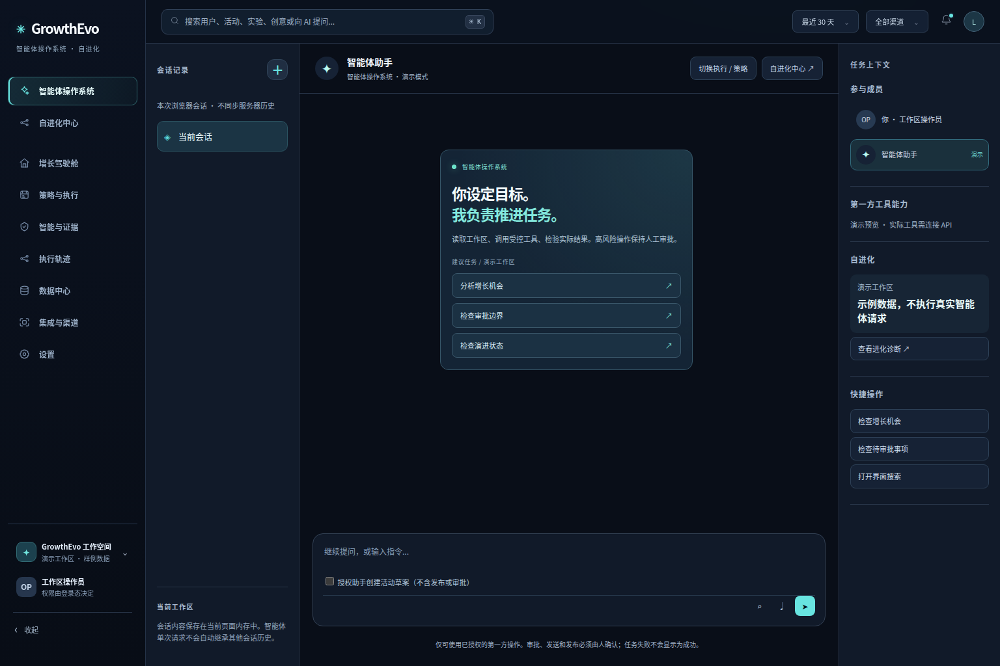
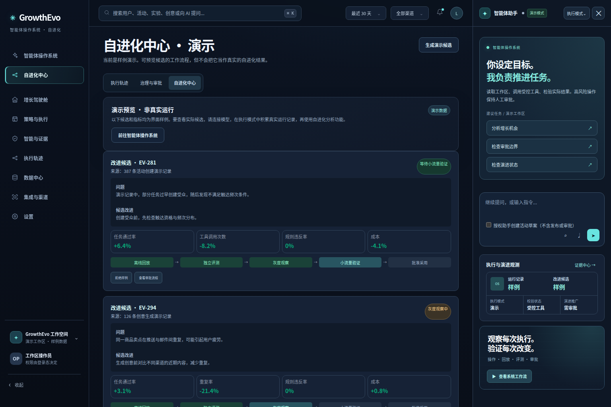
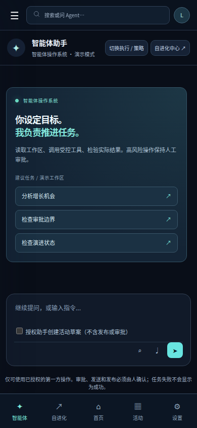
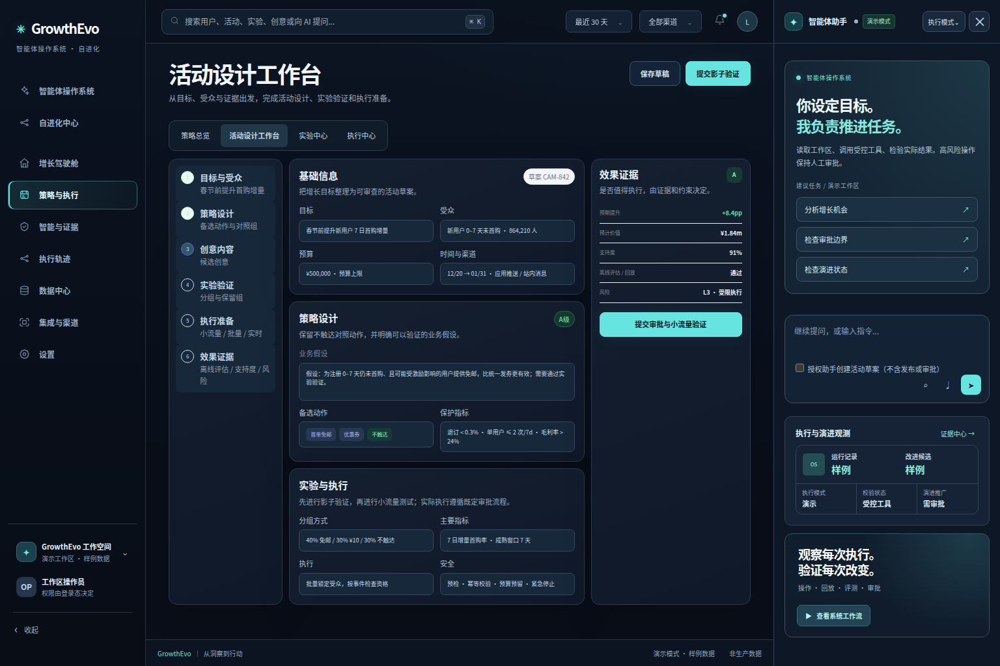

<div align="center">

# GrowthEvo

### 面向增长工作的智能体操作系统

**智能体操作系统 × 可验证的自进化 × 数据驱动增长**

增长的难题，不只是缺少数据或行动，而是判断、执行与反馈彼此割裂。GrowthEvo 将它们组织为同一条工作链：让智能体在授权范围内行动，让重要决策有迹可循，让每一次改进接受证据检验。

从理解用户、识别机会，到实验、旅程与复盘，始终看得见行动的依据、结果与边界。

**智能体操作系统 · 自进化中心 · Nightfall 工作台**

[智能体操作系统](#智能体操作系统) · [自进化中心](#自进化中心) · [数据驱动增长](#数据驱动增长运营) · [Nightfall 体验](#nightfall-体验) · [增长全流程](#一个工作空间完成增长全流程) · [产品体验](#体验-growthevo)

</div>

<p align="center">
  
</p>
<p align="center"><sub>Nightfall 桌面工作台 · 真实浏览器截图（示例业务数据）</sub></p>

---

## 智能体操作系统

### 从提出目标，到执行、核对与继续

你可以直接描述要完成的工作。智能体会结合当前增长机会、活动、实验与审批信息，在授权范围内推进任务，并展示实际采取的步骤。

<table>
<tr>
<td width="25%" valign="top">
<h4>提出目标</h4>
从一句自然语言开始，不必先找到正确的页面或报表。
</td>
<td width="25%" valign="top">
<h4>执行站内操作</h4>
读取工作区、打开相关页面，获得授权后创建活动草案。
</td>
<td width="25%" valign="top">
<h4>核对实际结果</h4>
界面操作等待浏览器回执，再把实际反馈带入下一步工作。
</td>
<td width="25%" valign="top">
<h4>中断后继续</h4>
接入持久化存储后，从执行轨迹继续任务，保留已经完成的步骤。
</td>
</tr>
</table>

**可以这样开始：** 帮我检查最近值得关注的增长机会，打开相关实验页面，并整理下一步行动。

配置可用模型后，智能体可以读取工作区、打开站内页面、展开搜索或筛选器，并定位活动草案输入框。界面操作按步骤执行，浏览器回传实际结果后，智能体再继续下一步；没有收到回执时，任务会等待确认。它不会绕过人的审批，也不会自行发布营销活动。

接入 PostgreSQL 后，执行轨迹和任务进度会持续保存。服务重启后，可以在**执行轨迹**中继续中断的任务，已保存的活动草案不会因恢复而重复创建。配置身份认证后，每个账号只能查看和继续自己的智能体任务；恢复草案操作仍需当前用户授权。

执行轨迹提供**继续任务**和**停止任务**入口，便于核对中断状态和已发生的操作。停止任务会阻止后续执行，已经保存的草案仍会保留。

---

## 自进化中心

### 不只是完成今天的任务，还要让下一次更好

<p align="center">
  
</p>
<p align="center"><sub>自进化中心 · 浏览器实拍，候选与数值为演示样例，不代表实际进化收益</sub></p>

GrowthEvo 从真实任务中发现受限的执行改进机会，整理成可以追踪的候选。自进化中心让团队看见智能体**正在尝试改善什么、验证进行到哪一步、现有证据是否足够**。

| 你在产品中看到 | 对你意味着什么 |
| --- | --- |
| **运行轨迹** | 知道 Agent 实际做过哪些事情，而不只看最后一句回答 |
| **改进候选** | 了解哪些工作方式可能值得调整，以及为什么 |
| **对照验证** | 在采用新做法之前，先与现有表现进行比较 |
| **采用门槛** | 离线通过后仍需影子、灰度验证与可信人工批准 |
| **持续积累** | 接入持久化存储后，候选、验证结果与当前策略跨重启保留 |

在 GrowthEvo，自进化有明确的含义：**改进方向能够积累，效果差异能够检验，采用决策必须有边界。**

积累足够的真实运行后，可以在自进化中心发起候选分析。部署者配置可用模型与独立验证任务集后，可以进行离线对照验证，查看结果和证据编号；数据不足或未配置验证时，会显示具体的就绪状态。离线通过不能直接说明线上效果提升。

接入 PostgreSQL 后，运行记录、改进候选与评测结果会跨重启保留；多个服务副本共享评测状态，失败或中断的评测可以重试。未接入数据库的开发环境仍使用进程内记录。自动上线推广与自主修改源码尚未开放。

---

## 数据驱动增长运营

### 从客户信号，到可解释的下一步行动

增长不应止于看见变化，更要回答下一步为什么值得做。Nightfall 的数据驱动运营工作台，将客户画像、行为事件、动态人群、素材与优惠、实验和旅程记录纳入同一套 PostgreSQL 数据链路。信号、决策、执行与反馈不再只是散落在各处的报表，而是可以相互核对的业务过程。

| 增长环节 | GrowthEvo 如何落实 |
| --- | --- |
| **理解客户** | 持久化客户属性、营销授权与动态人群，让是否有权触达成为决策的前提 |
| **捕捉变化** | 对事件去重、记录来源，通过新近行为触发旅程，历史回填不主动补发触达 |
| **谨慎选择** | 个体化决策保留不触达选项，记录完整动作概率；真正展示之后才确认曝光 |
| **检验效果** | 稳定实验分组，分开观察未成熟与成熟样本，以 Wilson 区间和样本比例失衡检查审视数据质量 |
| **执行旅程** | 持久化延迟任务，在触发、处理和外部提交前复核授权、人群资格与旅程状态 |
| **复盘策略** | 使用已有离线策略评估组件审视成熟反馈与历史决策概率，不凭单次结果自动改变线上策略 |

**真实记录必须有清楚的来源。** API 验证环境中的演示样本明确标记并存入 PostgreSQL，重启后仍可核对；生产模式不会导入演示样本。没有配置 PostgreSQL 时，增长运营接口会明确返回不可用，不用静态页面数据冒充实际业务结果。

**行动与证据必须守住边界。** 旅程 Worker 只准备待投递记录，不擅自发送营销消息。外部发送需要生产环境、独立授权和受限 HTTPS 网关；网关接受不等于客户送达。实验中的观测差异、统计区间和离线评估结果也不等于已证实的因果增量，更不是策略自动上线的许可。

[了解增长运营的数据模型、接口与执行边界](docs/GROWTH_OPERATIONS.md)

---

## Nightfall 体验

### 越复杂的工作，越需要清晰而克制的界面

GrowthEvo 的 **Nightfall** 设计语言，不是用大量霓虹装饰来制造科技感，而是让你在信息密集的场景中，依然能迅速看清**目标、当前状态、下一步操作和风险边界**。

<details>
<summary><b>Nightfall 的设计关键词</b></summary>

- **深色与克制：** 深海军蓝工作台，搭配少量青色高亮，减少长时间工作的视觉疲劳。
- **任务优先：** 智能体操作系统与自进化中心位于产品导航最前面。
- **清晰的层次：** 对话、任务、证据、活动与审批有明确的阅读顺序。
- **桌面与移动兼顾：** 不只是把桌面页面缩小，也重视小屏幕上的导航与操作。
- **真实状态：** 不用虚构的运行次数或增长成绩填满界面。

</details>

从首页的任务入口，到智能体侧栏、增长驾驶舱、实验和审批，Nightfall 把多个业务空间连接成一个统一的操作环境。

[了解 Nightfall 设计语言](docs/DESIGN_SYSTEM.md)

<p align="center">
  
</p>
<p align="center"><sub>Nightfall 移动端 · 真实浏览器截图（示例业务数据）</sub></p>


---

## 一个工作空间，完成增长全流程

增长不应该被拆散在聊天窗口、分析报表、活动工具和审批表格之间。GrowthEvo 把这些工作组织成一条自然的路径：

**发现机会 → 理解客户与约束 → 选择行动或不触达 → 设计实验 → 人工确认 → 核对结果 → 持续改进**

<table>
<tr>
<td width="50%" valign="top">
<h3>增长机会地图 · 找到值得行动的机会</h3>
知道哪些人群可能需要帮助、哪些机会值得投入资源，以及何时最好先不要打扰用户。
</td>
<td width="50%" valign="top">
<h3>活动设计 · 让想法成为具体方案</h3>
把目标、受众、动作、预算和限制条件汇集在一个地方，让方案可以讨论、修改与确认。
</td>
</tr>
<tr>
<td valign="top">
<h3>实验中心 · 用证据判断结果</h3>
区分分组、实际曝光与观察窗口，了解哪些差异值得继续验证，哪些结论仍需更多证据。
</td>
<td valign="top">
<h3>治理与审批 · 关键动作有人把关</h3>
对重要的业务动作保留清晰的审批过程，让团队知道谁需要确认，以及为什么。
</td>
</tr>
<tr>
<td valign="top">
<h3>增长驾驶舱 · 随时了解整体进展</h3>
把增长趋势、活动状态、渠道表现和待办事项放到同一个驾驶舱，减少来回切换。
</td>
<td valign="top">
<h3>自进化中心 · 把经验带到下一次工作</h3>
让改进建议、验证结果与采用状态可见，使 Agent 的工作方式能够逐步改善。
</td>
</tr>
</table>

### 一次产品使用旅程

<p align="center">
  
</p>
<p align="center"><sub>活动设计 · 浏览器实拍（演示工作空间）</sub></p>

你可以先请智能体检查近期增长机会，再进入活动设计完善方案，在实验中心判断证据是否充分，在审批中心决定是否继续。接入 PostgreSQL 后，客户事件与旅程记录可以持续积累，执行中断也能从检查点继续。完成任务后，自进化中心进一步审视哪些工作方式值得改进。

**不行动，同样是经过判断的行动。** GrowthEvo 将不触达保留为正式选择。真正的增长不以增加消息数量为目标，而以创造可验证的用户价值为准绳。

---

## 为谁而设计

| 团队 | 可以如何使用 GrowthEvo |
| --- | --- |
| **增长与生命周期团队** | 从发现机会到规划下一次用户互动，始终围绕实际业务目标行动 |
| **CRM 与运营团队** | 让活动准备、内容协作、审批和执行进展有更清晰的上下文 |
| **实验与分析团队** | 将实验和业务判断放在同一工作空间，方便共同讨论结果 |
| **业务负责人** | 看到当前重点、潜在风险、待审批事项与持续改进的方向 |
| **AI 产品与 Agent 团队** | 了解 Agent 实际采取的步骤，以及哪些改进已经得到验证 |

---

## 为什么是 GrowthEvo

智能化的价值，不在于生成了多少建议，而在于三个问题能否得到可靠回答：

- **能否行动。** 在清楚的权限和业务约束下，把判断变成可核对的实际步骤。
- **凭什么判断。** 让客户信号、决策依据、实验观察与执行回执形成连续的证据链。
- **如何变得更好。** 从真实轨迹中发现改进方向，经独立验证后再决定是否采用。

因此，**智能体操作系统**负责推进受控工作，**数据驱动增长运营**连接业务反馈，**自进化中心**检验下一次是否能够做得更好。行动有边界，判断有依据，改进有门槛。

---

## 产品证据

GrowthEvo 重视真实结果，也重视证据适用的范围。下面是仓库中可复核的**公开数据评估记录**，用于展示项目在增长场景中的验证工作；它们**不是客户投放收益，也不是 Agent 自进化后的效果承诺**。

<details>
<summary><b>查看公开数据验证记录</b></summary>

以 **Criteo Uplift v2.1** 公开数据集为例，项目针对 **13,979,592** 条记录进行了已固定评估条件的验证：

<table>
<tr>
<td width="33%" align="center"><h3>+0.94 pp</h3><sub>整体人群增量访问</sub></td>
<td width="33%" align="center"><h3>+9.38 pp</h3><sub>选定 Top 10% 人群增量访问</sub></td>
<td width="33%" align="center"><h3>13.98M</h3><sub>公开数据记录</sub></td>
</tr>
</table>

你可以直接查看原始记录：[Criteo 公开评估](benchmarks/targeting/results/criteo-v2.1-visit-top10/7ac26a5a/README.md) · [Open Bandit Dataset 公开评估](benchmarks/ope/results/obd-full-all-random-to-bts/7d538cea/README.md)。

</details>

产品不应该把参考数据、演示画面和真实客户效果混为一谈。GrowthEvo 会持续保持这种区分。

---

## 体验 GrowthEvo

### 先从演示工作空间开始

你可以在本地启动 Nightfall 界面，探索智能体、增长驾驶舱、活动、实验、自进化和审批等页面。

```bash
git clone https://github.com/jiaweine/GrowthEvo-Harness.git
cd GrowthEvo-Harness
python -m pip install -e '.[web]'
GROWTHEVO_MODE=demo growthevo-web --host 127.0.0.1 --port 8765
```

打开 [本地工作空间](http://127.0.0.1:8765)。

演示工作空间使用明确标识的样例数据；体验真实 Agent 执行需要另行配置模型服务。当前的 Agent 操作范围是 **GrowthEvo 内部的受控业务工具和站内导航**，不是任意网站的通用浏览器自动控制。草案创建需要用户明确同意，审批与发布不会由 Agent 自行决定。

### 接入数据库，运行增长工作台

若要保存真实的客户与任务记录，并验证事件、旅程和实验的完整链路，可以按自托管指南启用 PostgreSQL。仓库提供的是受控的 API 验证环境，不会因为有了数据库就自动向外部渠道发送消息。

```bash
cp .env.self-host.example .env
# 先在 .env 中填写数据库密码与 PostgreSQL 连接地址
docker compose config --quiet
docker compose up -d --build
curl --fail http://127.0.0.1:8765/api/ready
```

本地 API 模式可以将明确标记的演示样本持久化，供你逐环节验证操作与回执。对公网提供服务前，应按[运行与部署指南](docs/SELF_HOSTING.md)启用生产模式、身份验证、HTTPS 与必要的渠道授权。

### 按需开启真实能力

| 你希望体验 | 需要准备 | 产品中的入口 |
| --- | --- | --- |
| 智能体执行站内任务 | 配置可用模型并启动 API 模式 | 智能体操作系统 |
| 服务重启后继续任务 | 接入 PostgreSQL | 执行轨迹 → 继续任务 |
| 分别保存各账号的智能体任务与候选 | 配置身份认证 | 登录后的智能体与自进化工作空间 |
| 验证候选改进 | 积累真实运行，配置模型与独立验证任务集 | 自进化中心 → 分析与离线验证 |
| 持久化增长运营与实验 | PostgreSQL 与 API 模式 | 数据驱动运营 |
| 核查个体化策略的离线证据 | 确认曝光、成熟反馈和完整决策概率 | 增长运营接口与部署文档 |

未接入 PostgreSQL 时，智能体与自进化的开发态记录只保留在当前进程，增长运营接口则明确不可用。配置身份认证后，智能体执行、自进化与新增长运营记录使用经过验证的身份作用域；现有活动和审批等业务数据仍属于共享工作空间，不应据此推断产品已经具备完整的企业组织权限治理。

接入配置与部署步骤见 [运行与部署指南](docs/SELF_HOSTING.md)、[模型接入指南](docs/llm_provider_runtime.md) 和[智能体使用说明](docs/AGENT_OPERATING_SYSTEM.md)。

---

## 更多关于 GrowthEvo

[产品架构与能力边界](docs/AGENT_OPERATING_SYSTEM.md) · [Nightfall 设计规范](docs/DESIGN_SYSTEM.md) · [项目当前状态](docs/IMPLEMENTATION_STATUS.md) · [技术与研究资料](docs/ARCHITECTURE.md)

[参与贡献](CONTRIBUTING.md) · [问题与建议](https://github.com/jiaweine/GrowthEvo-Harness/issues) · [安全政策](SECURITY.md)

---

<div align="center">

### GrowthEvo

**从洞察到行动，从行动到持续改进。**

<sub>让每一次决策有依据，让每一步执行可核对，让下一次改进经得起验证。</sub>

</div>
